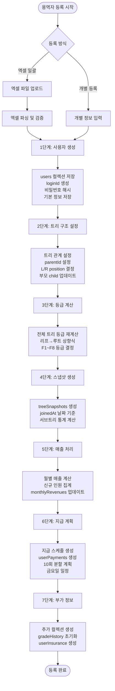

# MLM 시스템 설계 문서

**버전**: 3.0
**작성일**: 2025년 10월 3일
**최종 수정**: 2025년 10월 3일 (지급 규칙 변경 반영)
**시스템명**: NanumPay MLM Management System

---

## 목차

1. [시스템 개요](#1-시스템-개요)
2. [데이터베이스 설계](#2-데이터베이스-설계)
3. [등급 계산 시스템](#3-등급-계산-시스템)
4. [매출 및 지급 시스템](#4-매출-및-지급-시스템)
5. [시스템 아키텍처](#5-시스템-아키텍처)
6. [운영 지침](#6-운영-지침)

---

## 1. 시스템 개요

### 1.1 시스템 목적
MLM(Multi-Level Marketing) 비즈니스 모델을 지원하는 용역자 관리 및 수익 분배 시스템

### 1.2 핵심 기능
- **이진트리 구조** 기반 조직 관리
- **8단계 등급 시스템** (F1~F8)
- **자동 매출 계산** 및 **10회 분할 지급**
- **누적식 수익 배분** 방식

### 1.3 시스템 특징
- ✅ 완전 자동화된 등급 계산
- ✅ 투명한 수익 분배 구조
- ✅ 실시간 트리 구조 시각화
- ✅ 배치 처리 최적화

---

## 2. 데이터베이스 설계

### 2.1 전체 컬렉션 구조

#### 2.1.1 컬렉션 개요

| 분류 | 컬렉션명 | 용도 |
|-----|---------|-----|
| **사용자** | users | 용역자 정보 + 트리 구조 |
| | admins | 관리자 계정 (별도) |
| **매출/지급** | monthlyRevenues | 월별 매출 집계 |
| | userPayments | 개인별 지급 계획 |
| | weeklyPayments | 주별 실제 지급 |
| **이력** | gradeHistory | 등급 변경 이력 |
| | treeSnapshots | 트리 상태 스냅샷 |
| **보험** | userInsurance | 보험 정보 (F3+) |
| **시스템** | systemConfigs | 시스템 설정값 |
| | systemConfigHistory | 설정 변경 이력 |
| **스냅샷 확장** | insuranceSnapshots | 보험 상태 스냅샷 |
| | paymentConditionSnapshots | 지급 조건 스냅샷 |
| | revenueSnapshots | 매출 집계 스냅샷 |

### 2.2 상세 스키마 정의

#### 2.2.1 users 컬렉션
```javascript
{
  _id: ObjectId,
  
  // 계정 정보
  loginId: String,            // 고유 로그인 ID (unique index)
  passwordHash: String,       // bcrypt 해시
  
  // 기본 정보
  name: String,              // 성명
  phone: String,             // 연락처
  email: String,
  idNumber: String,          // 주민번호 (암호화)
  
  // 계좌 정보
  bank: String,              // 은행명
  accountNumber: String,     // 계좌번호
  
  // MLM 트리 구조
  parentId: String,          // 부모 loginId (null = 루트)
  position: String,          // 'L' | 'R'
  leftChildId: String,       // 왼쪽 자식 loginId
  rightChildId: String,      // 오른쪽 자식 loginId
  
  // 등급 정보
  currentGrade: String,      // F1~F8
  gradePaymentCount: Number, // 현 등급 누적 지급 횟수
  lastGradeChangeDate: Date,
  consecutiveGradeWeeks: Number, // F1/F2 연속 유지 주수
  
  // 판매인 정보
  salesperson: String,       // 추천인 이름
  salespersonPhone: String,
  planner: String,          // 설계사
  plannerPhone: String,
  
  // 보험 정보 (F3+ 필수)
  insuranceProduct: String,
  insuranceCompany: String,
  branch: String,           // 지사
  insuranceActive: Boolean,
  insuranceAmount: Number,
  
  // 시스템 정보
  type: "user",
  status: String,           // 'active' | 'inactive' | 'suspended'
  joinedAt: Date,          // 가입일 (관리자 지정 가능)
  createdAt: Date,         // 매출 귀속 월 결정
  updatedAt: Date,
  sequence: Number         // 등록 순서
}
```

#### 2.2.2 monthlyRevenues 컬렉션
```javascript
{
  _id: ObjectId,
  month: String,              // "2024-09"
  totalRevenue: Number,       // 월 총매출
  userCount: Number,          // 신규 가입자 수
  
  // 등급별 분포
  gradeDistribution: {
    F1: Number, F2: Number, F3: Number, F4: Number,
    F5: Number, F6: Number, F7: Number, F8: Number
  },
  
  // 등급별 지급액 (자동 계산)
  gradePayments: {
    F1: Number, F2: Number, F3: Number, F4: Number,
    F5: Number, F6: Number, F7: Number, F8: Number
  },
  
  // 관리자 수동 설정 (우선 적용)
  manualGradeAmounts: {
    F1: Number, F2: Number, F3: Number, F4: Number,
    F5: Number, F6: Number, F7: Number, F8: Number
  },
  
  // 지급 제외자
  excludedUsers: [{
    userId: String,
    reason: String,           // 'MAX_PAYMENT' | 'INSURANCE_NOT_MET'
    details: Object
  }],
  
  isCalculated: Boolean,
  calculatedAt: Date,
  processedBy: String,
  createdAt: Date,
  updatedAt: Date
}
```

#### 2.2.3 userPayments 컬렉션
```javascript
{
  _id: ObjectId,
  userId: String,             // loginId
  revenueMonth: String,       // "2024-09"
  
  // 지급 계획
  totalAmount: Number,        // 총 지급액
  isManualOverride: Boolean,  // 수동 설정 여부
  
  // 10회 분할 상세
  installments: [{
    installment: Number,      // 회차 (1~10)
    scheduledDate: Date,      // 지급 예정일 (금요일)
    gradeReferenceDate: Date, // 등급 기준일 (-1월 -1일)
    gradeAtPayment: String,   // 기준일 등급
    baseAmount: Number,       // 지급액
    
    // 보험 조건 체크
    insuranceConditionMet: Boolean,
    
    // 지급 처리
    status: String,           // 'pending' | 'paid' | 'failed' | 'blocked'
    blockedReason: String,    // 'insurance' | 'max_count'
    
    // 실지급
    withholdingTax: Number,   // 원천징수 (3.3%)
    netAmount: Number,        // 실지급액
    paidDate: Date,
    transactionId: String
  }],
  
  // 지급 자격
  isEligible: Boolean,
  ineligibleReason: String,
  gradePaymentCountAtCreation: Number,
  
  // 집계
  totalPaidAmount: Number,
  totalPaidCount: Number,
  
  createdAt: Date,
  updatedAt: Date
}
```

#### 2.2.4 treeSnapshots 컬렉션
```javascript
{
  _id: ObjectId,
  date: Date,               // 스냅샷 시점
  purpose: String,          // 'daily' | 'payment' | 'grade_calc'
  
  nodes: [{
    userId: String,         // loginId
    name: String,
    grade: String,          // 당시 등급
    parentId: String,
    leftChildId: String,
    rightChildId: String,
    position: String,       // 'L' | 'R'
    
    // 서브트리 통계
    leftSubtree: {
      F1: Number, F2: Number, F3: Number, F4: Number,
      F5: Number, F6: Number, F7: Number, F8: Number
    },
    rightSubtree: {
      F1: Number, F2: Number, F3: Number, F4: Number,
      F5: Number, F6: Number, F7: Number, F8: Number
    },
    
    isActive: Boolean       // joinedAt <= date
  }],
  
  statistics: {
    activeUsers: Number,
    gradeDistribution: Object,
    maxDepth: Number
  },
  
  createdAt: Date
}
```

#### 2.2.5 systemConfigs 컬렉션
```javascript
{
  _id: ObjectId,
  category: String,           // 'payment' | 'grade' | 'insurance' | 'system'
  key: String,               // 설정 키 (unique)
  value: Mixed,              // 설정 값
  description: String,
  dataType: String,          // 'number' | 'string' | 'object' | 'array'
  
  validation: {
    min: Number,
    max: Number,
    enum: Array,
    pattern: String          // 정규식
  },
  
  effectiveDate: Date,
  expiryDate: Date,
  isActive: Boolean,
  
  modifiedBy: String,
  modifiedAt: Date,
  version: Number
}
```

#### 2.2.6 스냅샷 확장 컬렉션

##### insuranceSnapshots
```javascript
{
  userId: String,
  date: Date,
  insuranceStatus: {
    hasInsurance: Boolean,
    monthlyAmount: Number,
    isMaintained: Boolean,     // F3+ 유지 조건
    maintenanceStartDate: Date,
    product: String,
    company: String
  },
  createdAt: Date
}
```

##### paymentConditionSnapshots
```javascript
{
  date: Date,
  userId: String,
  grade: String,
  conditions: {
    hasMinimumInsurance: Boolean,
    paymentCount: Number,
    maxPaymentCount: Number,
    consecutiveGradeWeeks: Number,  // F1/F2 연속 주수
    isEligible: Boolean,
    eligibilityReason: String
  },
  createdAt: Date
}
```

##### revenueSnapshots
```javascript
{
  month: String,              // "2024-09"
  totalRevenue: Number,
  userCount: Number,
  processedAt: Date,
  details: [{
    userId: String,
    amount: Number,
    grade: String
  }]
}
```

### 2.3 등록 프로세스

#### 2.3.0 등록 방식 개요

**용역자 등록 방법:**
1. **엑셀 일괄 등록**: API `/api/admin/users/bulk`
2. **개별 등록**: API `/api/admin/users/register`

**공통 필수 항목:**
- 성명 (name)
- 연락처 (phone)
- 은행 (bank)
- 계좌번호 (accountNumber)
- 판매인/추천인 (salesperson)
- 가입일자 (date)

**공통 자동 처리:**
- loginId: 성명 소문자 변환 (중복 시 A, B, C 추가)
- password: 전화번호 뒷 4자리 (기본 1234)
- position: 판매인의 L→R 우선 배치
- grade: 초기 F1, 이후 자동 재계산

#### 2.3.1 엑셀 일괄 등록

**헤더 형식:**
```
순번, 날짜, 성명, 연락처, 주민번호, 은행, 계좌번호,
판매인, 연락처, 설계사, 연락처, 보험상품명, 보험회사, 지사
```

**실제 엑셀 헤더:**
```
순번 | 날짜 | 성명 | 연락처 | 주민번호 | 은행 | 계좌번호 | 판매인 | 연락처 | 설계사 | 연락처 | 보험상품명 | 보험회사 | 지사
```

**헤더 매핑 (유연한 형식 지원):**
```javascript
// 다양한 헤더명 지원
성명: ['성명', '이름', 'name', '__EMPTY_1']
연락처: ['연락처', '전화번호', 'phone', '__EMPTY_2']
날짜: ['날짜', 'date', '__EMPTY']
판매인: ['판매인', '추천인', 'salesperson', '__EMPTY_6']

// __EMPTY 형식 처리 (xlsx 라이브러리)
__EMPTY: 날짜
__EMPTY_1: 성명
__EMPTY_2: 연락처
...
```

**헤더 행 처리:**
```javascript
// 첫 번째 행이 헤더인 경우 자동 건너뛰기
if (userData['용 역 자 관 리 명 부'] === '순번') {
  continue; // 헤더 행 스킵
}
```

#### 2.3.2 2단계 등록 프로세스 (핵심)

**1단계: 사용자 등록 (부모 관계 없이)**
```javascript
for (const userData of users) {
  // 1. loginId 자동 생성
  let loginId = name.toLowerCase();
  while (await User.exists({ loginId })) {
    counter++;
    loginId = name.toLowerCase() + String.fromCharCode(64 + counter); // A, B, C...
  }

  // 2. 비밀번호 생성
  const phoneDigits = phone.replace(/[^0-9]/g, '');
  const password = phoneDigits.length >= 4 
    ? phoneDigits.slice(-4)  // 전화번호 뒷 4자리
    : '1234';                // 기본값

  // 3. 시퀀스 번호 할당 (등록 순서 추적)
  currentSequence++;

  // 4. createdAt 설정 (매출 귀속 월 결정)
  let createdAt;
  if (dateValue) {
    // Excel 날짜 숫자 형식
    if (!isNaN(dateValue)) {
      const excelDate = parseInt(dateValue);
      createdAt = new Date((excelDate - 25569) * 86400 * 1000);
    } else {
      // 문자열 날짜
      createdAt = new Date(dateValue);
    }
  } else {
    createdAt = new Date(); // 오늘 날짜
  }

  // 5. 사용자 생성 (parentId 없이, 판매인 정보만 저장)
  const newUser = new User({
    loginId,
    passwordHash: await bcrypt.hash(password, 10),
    name,
    phone,
    salesperson,  // 나중에 부모 찾기용
    grade: 'F1',  // 초기 등급
    sequence: currentSequence,
    createdAt: createdAt  // 매출 귀속 월 결정
  });

  await newUser.save();
  registeredUsers.set(loginId, { user: newUser, salesperson, name });
}
```

**2단계: 부모-자식 관계 설정 (엑셀 순서대로)**

**MLM 검증 룰:**
```javascript
// 1. 시스템 전체 루트 노드 검증 (전체 시스템에 루트는 1개만)
const rootCandidates = registeredUsers.filter(info =>
  info.salesperson === '-' || !info.salesperson
);

if (rootCandidates.length > 1) {
  throw new Error('엑셀 파일 내 루트 노드는 1명만 허용됩니다');
}

// 기존 시스템에 루트 존재 확인
const existingRoot = await User.findOne({ parentId: null });

if (rootCandidates.length === 1 && existingRoot) {
  throw new Error(`시스템에 이미 루트 노드가 존재합니다: ${existingRoot.name} (${existingRoot.loginId})`);
}

// 2. 자기 자신 판매인 방지
if (info.salesperson === info.name) {
  throw new Error('자기 자신을 판매인으로 등록할 수 없습니다');
}
```

**중요**: 전체 시스템에서 `parentId = null`인 루트 노드는 **단 1개만** 허용됩니다.

**판매인 검색 우선순위:**
```javascript
for (const orderInfo of usersByOrder) {
  const info = registeredUsers.get(orderInfo.loginId);
  
  // 루트 노드는 부모 없이 그대로 둠
  if (info.salesperson === '-' || !info.salesperson) {
    continue;
  }

  // 판매인 검색 (우선순위)
  let parentUser = null;

  // 우선순위 1: 기존 DB 사용자
  parentUser = await User.findOne({
    $or: [
      { name: info.salesperson },
      { loginId: info.salesperson.toLowerCase() }
    ],
    type: 'user'
  });

  // 우선순위 2: 방금 등록한 사용자
  if (!parentUser) {
    for (const [regLoginId, regInfo] of registeredUsers) {
      if (regInfo.name === info.salesperson) {
        parentUser = regInfo.user;
        break;
      }
    }
  }

  // 판매인을 찾을 수 없으면 실패
  if (!parentUser) {
    failedUsers.push(info.name);
    results.errors.push(`❌ ${info.name}: 판매인 '${info.salesperson}'을(를) 찾을 수 없습니다.`);
    continue;
  }

  // L/R 위치 결정
  const leftChild = await User.findOne({ 
    parentId: parentUser.loginId, 
    position: 'L' 
  });
  const rightChild = await User.findOne({ 
    parentId: parentUser.loginId, 
    position: 'R' 
  });

  let position = null;
  if (!leftChild) {
    position = 'L';  // 왼쪽 우선
  } else if (!rightChild) {
    position = 'R';  // 왼쪽 차있으면 오른쪽
  }

  if (position) {
    // 부모-자식 관계 설정
    await User.findOneAndUpdate(
      { loginId: info.user.loginId },
      { parentId: parentUser.loginId, position }
    );

    // 부모의 자식 참조 업데이트
    const updateField = position === 'L' ? 'leftChildId' : 'rightChildId';
    await User.findOneAndUpdate(
      { loginId: parentUser.loginId },
      { [updateField]: info.user.loginId }
    );

    // 부모 등급 재계산
    await updateParentGrade(parentUser.loginId);
  } else {
    // 좌우 자리 모두 찬 경우
    failedUsers.push(info.name);
    results.alerts.push({
      type: 'warning',
      message: `${info.salesperson}님의 좌우 자리가 모두 찼습니다. ${info.name}님은 수동으로 배치해 주세요.`,
      parent: info.salesperson,
      user: info.name
    });
  }
}

// 실패한 사용자 삭제
for (const userName of failedUsers) {
  const userInfo = registeredUsers.find(info => info.name === userName);
  if (userInfo) {
    await User.findByIdAndDelete(userInfo.user._id);
  }
}
```

#### 2.3.3 개별 등록

**API 엔드포인트:** `/api/admin/users/register`

**요청 본문:**
```javascript
{
  name: String,           // 성명 (필수)
  phone: String,          // 연락처 (필수)
  bank: String,           // 은행 (필수)
  accountNumber: String,  // 계좌번호 (필수)
  salesperson: String,    // 판매인 이름 (필수, "-"는 루트 노드)
  date: String,           // 가입일자 (선택, 기본값: 오늘)
}
```

**처리 과정:**
```javascript
async function registerUser(userData) {
  // 1. loginId 생성 (중복 체크)
  let loginId = userData.name.toLowerCase();
  let counter = 0;
  while (await User.exists({ loginId })) {
    counter++;
    loginId = userData.name.toLowerCase() + String.fromCharCode(64 + counter);
  }
  
  // 2. 비밀번호 생성
  const phoneDigits = userData.phone.replace(/[^0-9]/g, '');
  const password = phoneDigits.length >= 4 ? phoneDigits.slice(-4) : '1234';
  
  // 3. 가입일자 처리
  const createdAt = userData.date ? new Date(userData.date) : new Date();
  
  // 4. 판매인 검색 및 루트 노드 검증
  let parentUser = null;

  if (userData.salesperson === '-' || !userData.salesperson) {
    // 루트 노드 등록 시도 - 시스템 전체에 1개만 허용
    const existingRoot = await User.findOne({ parentId: null });
    if (existingRoot) {
      throw new Error(`시스템에 이미 루트 노드가 존재합니다: ${existingRoot.name} (${existingRoot.loginId})`);
    }
  } else {
    // 일반 노드 - 판매인 검색
    parentUser = await User.findOne({
      $or: [
        { name: userData.salesperson },
        { loginId: userData.salesperson.toLowerCase() }
      ]
    });

    if (!parentUser) {
      throw new Error('판매인을 찾을 수 없습니다');
    }
  }
  
  // 5. L/R 위치 결정
  let position = null;
  if (parentUser) {
    const leftChild = await User.findOne({ 
      parentId: parentUser.loginId, 
      position: 'L' 
    });
    const rightChild = await User.findOne({ 
      parentId: parentUser.loginId, 
      position: 'R' 
    });
    
    if (!leftChild) position = 'L';
    else if (!rightChild) position = 'R';
    else throw new Error('판매인의 좌우 자리가 모두 찼습니다');
  }
  
  // 6. 사용자 생성
  const newUser = new User({
    loginId,
    passwordHash: await bcrypt.hash(password, 10),
    name: userData.name,
    phone: userData.phone,
    bank: userData.bank,
    accountNumber: userData.accountNumber,
    parentId: parentUser ? parentUser.loginId : null,
    position: position,
    grade: 'F1',
    createdAt: createdAt
  });
  
  await newUser.save();
  
  // 7. 부모의 자식 참조 업데이트
  if (parentUser && position) {
    const updateField = position === 'L' ? 'leftChildId' : 'rightChildId';
    await User.findOneAndUpdate(
      { loginId: parentUser.loginId },
      { [updateField]: newUser.loginId }
    );
  }
  
  // 8. 등급 재계산 및 매출 계산
  await processNewUsers([newUser.loginId]);
  
  return newUser;
}
```

#### 2.3.4 배치 처리 최적화
```javascript
// 효율적 배치 처리
const allUsers = await User.find().lean();
const gradeUpdates = calculateAllGrades(allUsers);
await User.bulkWrite(gradeUpdates);
await UserPaymentPlan.insertMany(plans);
```

#### 2.3.5 자동 배치 처리 트리거

**실행 시점:**
1. **엑셀 일괄 등록 시** (`/api/admin/users/bulk`)
   - 모든 사용자 등록 완료 후 자동 실행
   
2. **개별 등록 시** (`/api/admin/users/register`)
   - 1명 등록 후 자동 실행
   
3. **수동 재계산 시** (`/api/admin/revenue/calculate`)
   - 관리자가 명시적으로 실행

**처리 순서:**
```javascript
// BatchProcessor.processNewUsers() 실행
async function processNewUsers(userIds) {
  // 1. 전체 등급 재계산 (리프부터 상향식)
  await recalculateAllGrades();

  // 2. 월별 그룹화 (createdAt 기준)
  const usersByMonth = new Map();
  for (const user of users) {
    const year = user.createdAt.getFullYear();
    const month = user.createdAt.getMonth() + 1;
    const monthKey = `${year}-${String(month).padStart(2, '0')}`;
    
    if (!usersByMonth.has(monthKey)) {
      usersByMonth.set(monthKey, []);
    }
    usersByMonth.get(monthKey).push(user);
  }

  // 3. 각 월별 매출 계산
  for (const [monthKey, users] of usersByMonth) {
    const [year, month] = monthKey.split('-').map(Number);
    await calculateMonthlyRevenueForMonth(year, month);
  }

  // 4. 지급 스케줄 생성
  await createPaymentSchedules();

  // 5. 개인별 지급 계획 생성
  await createUserPaymentPlans();
}
```

#### 2.3.6 매출 귀속 월 결정 규칙

**기본 원칙:**
- `createdAt` 필드의 년/월을 기준으로 매출 귀속 월 결정
- 엑셀 "날짜" 컬럼 → `createdAt` 매핑

**날짜 처리 우선순위:**
```javascript
// 1. Excel 숫자 형식 (예: 45231 = 2023-10-15)
if (!isNaN(dateValue)) {
  const excelDate = parseInt(dateValue);
  createdAt = new Date((excelDate - 25569) * 86400 * 1000);
}

// 2. 문자열 형식 (예: '2025-07-01', '2025/07/01', '20250701')
else {
  createdAt = new Date(dateValue);
}

// 3. 날짜가 없거나 유효하지 않으면 오늘 날짜
if (!dateValue || isNaN(createdAt.getTime())) {
  createdAt = new Date();
}
```

**매출 계산 시 월별 그룹화:**
```javascript
// 예시: 하나의 엑셀에 여러 달 데이터 포함 가능
// 2025년 7월: 5명
// 2025년 8월: 3명
// 2025년 9월: 2명

→ 각각 별도 MonthlyRevenue 생성
  - 2025-07: 5명 × 100만원 = 500만원
  - 2025-08: 3명 × 100만원 = 300만원
  - 2025-09: 2명 × 100만원 = 200만원
```

---

## 3. 등급 계산 시스템

### 3.1 등급 정의

| 등급 | 조건 | 설명 |
|------|------|------|
| **F1** | 자식 0~1개 | 리프 또는 불완전 노드 |
| **F2** | 좌우 자식 모두 | 완전 이진 노드 |
| **F3** | 좌우 각 F2 1개씩 | F2 균형 보유 |
| **F4** | 좌우 각 F3 1개씩 | F3 균형 보유 |
| **F5** | F4 총 3개 이상 (최소 1:2 또는 2:1) | F4 비대칭 허용 |
| **F6** | F5 총 3개 이상 (최소 1:2 또는 2:1) | F5 비대칭 허용 |
| **F7** | F6 총 3개 이상 (최소 1:2 또는 2:1) | F6 비대칭 허용 |
| **F8** | F7 총 3개 이상 (최소 1:2 또는 2:1) | 최고 등급 |

### 3.2 계산 알고리즘

```javascript
async function calculateGrade(userId) {
  // 1. 자식 확인
  const leftChild = await User.findOne({ parentId: userId, position: 'L' });
  const rightChild = await User.findOne({ parentId: userId, position: 'R' });

  // 2. F1: 자식 불완전
  if (!leftChild || !rightChild) return 'F1';

  // 3. 서브트리 등급 수집
  const leftGrades = await collectSubtreeGrades(leftChild.loginId);
  const rightGrades = await collectSubtreeGrades(rightChild.loginId);

  // 4. 등급 결정 로직
  if (leftGrades.F2 >= 1 && rightGrades.F2 >= 1) {
    if (leftGrades.F3 >= 1 && rightGrades.F3 >= 1) {
      if (leftGrades.F4 >= 1 && rightGrades.F4 >= 1) {
        // F5 이상 체크...
        return 'F5';
      }
      return 'F4';
    }
    return 'F3';
  }
  return 'F2';
}
```

### 3.3 실제 트리 예시 (21노드)

```
                    1(F4)
                  /      \
              2(F3)      3(F3)
             /    \      /    \
          4(F2)  5(F2) 6(F2)  7(F3)
         /  \    /  \   /  \   /  \
       8(F1)... [리프 노드들] ...21(F1)
```

**등급 분포:**
- F1: 11명 (리프)
- F2: 6명
- F3: 3명
- F4: 1명 (루트)

---

## 4. 매출 및 지급 시스템

### 4.1 매출 및 지급 기준 (핵심 규칙 - v3.0 변경)

#### 4.1.1 매출 집계 기간 및 계산

**매출 집계 기간:**
```
매월 1일 00:00:00 ~ 말일 23:59:59
```

**기본 공식:**
```
월 총매출 = 해당 월 신규 가입 인원 × 100만원
```

**예시:**
```
9월 1일~30일 신규 가입: 10명
9월 총매출: 1,000만원
```

#### 4.1.2 지급일 및 등급 기준 (중요 변경사항)

**지급일:**
```
매주 금요일
```

**등급 기준일 계산 공식:**
```
지급일: N년 M월 D일 (금요일)
등급 기준일: N년 (M-1)월 (D-1)일 최종 등급

예외 처리: 전월에 (D-1)일이 없는 경우 → 전월 말일 최종 등급
```

**구체적 예시:**

| 지급일 | 등급 기준일 계산 | 실제 등급 기준일 | 비고 |
|--------|------------------|------------------|------|
| 10/3(금) | 9월 2일 | 9월 2일 23:59:59 | 정상 |
| 10/11(금) | 9월 10일 | 9월 10일 23:59:59 | 정상 |
| 11/1(금) | 10월 0일 | 9월 30일 23:59:59 | 10월 0일 없음 |
| 3/31(금) | 2월 30일 | 2월 28일 23:59:59 | 2월 30일 없음 |

**등급 기준일 계산 로직:**
```javascript
function getGradeReferenceDate(paymentDate) {
  const year = paymentDate.getFullYear();
  const month = paymentDate.getMonth(); // 0-11
  const day = paymentDate.getDate();
  
  // 전월 (day-1)일 시도
  let targetDate = new Date(year, month - 1, day - 1);
  
  // 유효하지 않으면 전월 말일로
  if (targetDate.getMonth() !== (month - 1 + 12) % 12) {
    targetDate = new Date(year, month, 0); // 전월 말일
  }
  
  // 23:59:59 시점의 등급
  targetDate.setHours(23, 59, 59, 999);
  
  return targetDate;
}
```

**매출 기준:**
```
지급일: N년 M월 D일
매출 기준: N년 (M-1)월 1일~말일 총매출
```

#### 4.1.3 종합 지급 예시

**예시 1: 등급 유지**
```
지급일: 2024년 10월 3일 (금)
등급 기준: 2024년 9월 2일 최종 등급 = F2
매출 기준: 2024년 9월 총매출
지급액: 9월 F2 지급액 100만원 ÷ 10 = 10만원
```

**예시 2: 등급 변동 (회차별 금액 변동)**
```
9월 등급 변화:
- 9/1~9/6: F2
- 9/7~9/30: F3

10월 3일(금) 지급:
- 등급 기준: 9/2 → F2
- 지급액: F2 금액 10만원

10월 11일(금) 지급:
- 등급 기준: 9/10 → F3
- 지급액: F3 금액 15만원

→ 같은 9월 매출이지만 금요일마다 지급액 다름
```

**기존 규칙과의 차이:**
```
[기존 v2.0]
- 매출 발생 월 등급 고정
- 10회 모두 동일 금액

[신규 v3.0]
- 지급일 기준 전월 등급 사용
- 회차마다 금액 다를 수 있음
```

### 4.2 등급별 지급 비율

| 등급 | 기본 비율 | 누적 계산식 |
|------|-----------|-------------|
| F1 | 24% | (총매출×24%) ÷ (F1+F2인원) |
| F2 | 19% | F1지급액 + (총매출×19%) ÷ (F2+F3인원) |
| F3 | 14% | F2지급액 + (총매출×14%) ÷ (F3+F4인원) |
| F4 | 9% | F3지급액 + (총매출×9%) ÷ (F4+F5인원) |
| F5 | 5% | F4지급액 + (총매출×5%) ÷ (F5+F6인원) |
| F6 | 3% | F5지급액 + (총매출×3%) ÷ (F6+F7인원) |
| F7 | 2% | F6지급액 + (총매출×2%) ÷ (F7+F8인원) |
| F8 | 1% | F7지급액 + (총매출×1%) ÷ F8인원 |

**0명 처리 규칙:**
```javascript
// 등급별 인원이 0명인 경우 처리
if (gradeCount.F2 > 0 && gradeCount.F2 + gradeCount.F3 > 0) {
  // 정상 계산
  const f2Base = (totalRevenue * 0.19) / (gradeCount.F2 + gradeCount.F3);
  payments.F2 = Math.floor((f2Base + previousPayment) / 100) * 100;
} else {
  // 0명인 경우 이전 등급 금액 유지
  payments.F2 = previousPayment;
}
```

**100원 단위 절삭:**
```javascript
// Math.floor(금액 / 100) * 100
예: 1,234,567원 → 1,234,500원
```

**등급 고정 원칙 (중요):**
```javascript
// 매출 발생 시점(N월)의 등급으로 지급액 확정
// N+1월에 등급 변경되어도 N월 매출 지급액 불변
// UserPaymentPlan.grade 필드에 고정값 저장

예시:
- 9월 매출 발생 시 홍길동 등급: F2
- 10월에 F3으로 승급
- 9월 매출 지급액은 여전히 F2 금액으로 10회 지급
```

### 4.3 10회 분할 지급 (v3.0 변경)

#### 4.3.1 지급 일정

**기본 원칙:**
- **매주 금요일 지급**
- 매출 발생 익월부터 **연속 10개 금요일**

**예시:**
```
9월 매출 발생

10월 4일(금): 1회차 (등급 기준: 9/3)
10월 11일(금): 2회차 (등급 기준: 9/10)
10월 18일(금): 3회차 (등급 기준: 9/17)
10월 25일(금): 4회차 (등급 기준: 9/24)
11월 1일(금): 5회차 (등급 기준: 9/30, 10/0 없음)
11월 8일(금): 6회차 (등급 기준: 10/7)
11월 15일(금): 7회차 (등급 기준: 10/14)
11월 22일(금): 8회차 (등급 기준: 10/21)
11월 29일(금): 9회차 (등급 기준: 10/28)
12월 6일(금): 10회차 (등급 기준: 11/5)
```

**금요일 스케줄 생성 로직:**
```javascript
function generateFridaySchedule(revenueYear, revenueMonth) {
  const schedules = [];
  let currentDate = new Date(revenueYear, revenueMonth, 1); // 익월 1일
  
  // 첫 금요일 찾기
  while (currentDate.getDay() !== 5) { // 5 = 금요일
    currentDate.setDate(currentDate.getDate() + 1);
  }
  
  // 연속 10개 금요일
  for (let i = 1; i <= 10; i++) {
    const gradeRefDate = getGradeReferenceDate(currentDate);
    
    schedules.push({
      installment: i,
      paymentDate: new Date(currentDate),
      gradeReferenceDate: gradeRefDate
    });
    
    currentDate.setDate(currentDate.getDate() + 7); // 다음 금요일
  }
  
  return schedules;
}
```

#### 4.3.2 실제 계산 예시 (v3.0)

**시나리오:**
- 9월 총매출: 1,000만원
- 김철수 9월 등급 변화: 9/1~9/10 F2, 9/11~9/30 F3
- 등급 분포: F1(50), F2(10), F3(4), F4(2)

**등급별 개인 지급액 계산:**
```
F2 개인 지급액:
- F1 기본 = (1,000만원 × 24%) ÷ (50+10) = 40,000원
- F2 추가 = (1,000만원 × 19%) ÷ (10+4) = 135,714원
- F2 총액 = 40,000 + 135,714 = 175,714원 → 175,700원 (100원 절삭)

F3 개인 지급액:
- F2 누적 = 175,700원
- F3 추가 = (1,000만원 × 14%) ÷ (4+2) = 233,333원
- F3 총액 = 175,700 + 233,333 = 409,033원 → 409,000원 (100원 절삭)
```

**10회 지급 상세:**
```
10월 4일(금): 1회차
- 등급 기준: 9/3 → F2
- 지급: 175,700원 ÷ 10 = 17,570원

10월 11일(금): 2회차
- 등급 기준: 9/10 → F2
- 지급: 175,700원 ÷ 10 = 17,570원

10월 18일(금): 3회차
- 등급 기준: 9/17 → F3
- 지급: 409,000원 ÷ 10 = 40,900원

... (이후 회차도 각 금요일의 등급 기준일에 따라 계산)
```

**핵심 차이점:**
- v2.0: 10회 모두 동일 금액
- v3.0: 등급 변동 시 회차마다 금액 다름

### 4.4 중첩 지급 (v3.0 업데이트)

**여러 달 매출의 동시 지급:**
```
10월 4일(금) 수령 예시:

김철수 등급 기준: 9월 3일 = F2

├─ 7월 매출 7회차:
│  매출 기준: 7월
│  등급 기준: 9월 3일 F2
│  금액: 15,000원
│
├─ 8월 매출 3회차:
│  매출 기준: 8월
│  등급 기준: 9월 3일 F2
│  금액: 20,000원
│
└─ 9월 매출 1회차:
   매출 기준: 9월
   등급 기준: 9월 3일 F2
   금액: 17,570원

총 수령액: 52,570원
원천징수(3.3%): 1,735원
실지급액: 50,835원
```

**핵심 원칙:**
- 같은 금요일에 지급되는 **모든 매출의 등급 기준일은 동일**
- 10월 4일(금) → 모두 9월 3일 등급 기준
- 각 매출별 지급액은 **각 매출 발생 월의 총매출 기준으로 계산**
- 등급만 동일 기준일 적용

**중첩 지급 계산 로직:**
```javascript
async function calculateWeeklyPayment(userId, paymentDate) {
  const gradeRefDate = getGradeReferenceDate(paymentDate);
  const userGrade = await getUserGradeAt(userId, gradeRefDate);
  
  let totalAmount = 0;
  const details = [];
  
  // 해당 금요일에 지급될 모든 매출 조회
  const plans = await UserPaymentPlan.find({
    userId: userId,
    'installments.paymentDate': paymentDate
  });
  
  for (const plan of plans) {
    // 각 매출별 등급별 지급액 계산 (동일 등급 기준일)
    const monthlyRevenue = await MonthlyRevenue.findOne({
      month: plan.revenueMonth
    });
    
    const gradePayment = calculateGradePayment(
      monthlyRevenue.totalRevenue,
      monthlyRevenue.gradeDistribution,
      userGrade
    );
    
    const installmentAmount = Math.floor(gradePayment / 10 / 100) * 100;
    totalAmount += installmentAmount;
    
    details.push({
      revenueMonth: plan.revenueMonth,
      installment: plan.currentInstallment,
      amount: installmentAmount,
      grade: userGrade
    });
  }
  
  return {
    totalAmount,
    withholdingTax: Math.floor(totalAmount * 0.033),
    netAmount: Math.floor(totalAmount * 0.967),
    details
  };
}
```

### 4.5 원천징수

```
지급액: 40,905원
원천징수(3.3%): 1,350원
실지급액: 39,555원
```

### 4.6 등급별 지급금액 고정 설정 (v3.0 신규)

**기능:**
- 관리자가 특정 매출월의 **등급별 지급금액을 일괄 지정** 가능
- 자동 계산 무시하고 **고정 금액으로 10회 분할 지급**

**데이터 모델:**
```javascript
// MonthlyRevenue 확장
{
  month: String,              // "2024-09"
  totalRevenue: Number,
  gradeDistribution: Object,
  
  // 신규: 등급별 고정 금액
  manualGradeAmounts: {
    F1: Number,               // null이면 자동 계산
    F2: Number,
    F3: Number,
    F4: Number,
    F5: Number,
    F6: Number,
    F7: Number,
    F8: Number
  }
}

// UserPaymentPlan 확장
{
  userId: String,
  revenueMonth: String,
  grade: String,
  isManualOverride: Boolean,  // 해당 등급이 수동 설정되었는지
  totalAmount: Number,        // 고정 또는 자동 계산 금액
  // ... 기타 필드
}
```

**적용 예시:**
```
2024년 9월 매출 등급별 고정 설정:

관리자 설정:
- F1: 50,000원
- F2: 150,000원
- F3: 350,000원
- F4~F8: 미설정 (자동 계산)

자동 계산 결과:
- F2: 175,700원

실제 지급:
- 9월 F2 등급 모든 용역자: 150,000원 (고정)
- 10월부터 10개 금요일: 회차당 15,000원
- 등급 변동 무시
- 원천징수 3.3% 적용
```

**등급별 고정 설정 처리:**
```javascript
async function setMonthlyGradeAmounts(year, month, gradeAmounts) {
  const monthKey = `${year}-${String(month).padStart(2, '0')}`;
  
  // MonthlyRevenue에 등급별 고정 금액 저장
  await MonthlyRevenue.findOneAndUpdate(
    { month: monthKey },
    { 
      manualGradeAmounts: {
        F1: gradeAmounts.F1 || null,
        F2: gradeAmounts.F2 || null,
        F3: gradeAmounts.F3 || null,
        F4: gradeAmounts.F4 || null,
        F5: gradeAmounts.F5 || null,
        F6: gradeAmounts.F6 || null,
        F7: gradeAmounts.F7 || null,
        F8: gradeAmounts.F8 || null
      }
    },
    { upsert: true }
  );
  
  // 해당 월 모든 사용자 지급 계획 재생성
  await regeneratePaymentPlans(year, month);
}

async function calculateUserPaymentAmount(userId, revenueMonth) {
  const user = await User.findOne({ loginId: userId });
  const monthlyRevenue = await MonthlyRevenue.findOne({ 
    month: revenueMonth 
  });
  
  // 등급별 고정 금액 확인
  const manualAmount = monthlyRevenue.manualGradeAmounts?.[user.grade];
  
  if (manualAmount) {
    // 고정 금액 사용
    return {
      totalAmount: manualAmount,
      isManualOverride: true,
      installmentAmount: Math.floor(manualAmount / 10 / 100) * 100
    };
  } else {
    // 자동 계산 금액 사용
    const autoAmount = calculateGradePayment(
      monthlyRevenue.totalRevenue,
      monthlyRevenue.gradeDistribution,
      user.grade
    );
    
    return {
      totalAmount: autoAmount,
      isManualOverride: false,
      installmentAmount: Math.floor(autoAmount / 10 / 100) * 100
    };
  }
}
```

---

## 5. 용역자 등록 처리 프로세스

### 5.1 전체 처리 흐름도



### 5.2 단계별 상세 처리

#### 5.2.1 Stage 1: 사용자 생성
```javascript
// 1. loginId 중복 체크 및 생성
let loginId = name.toLowerCase();
let suffix = '';
while (await User.exists({ loginId: loginId + suffix })) {
  suffix = String.fromCharCode(65 + counter++); // A, B, C...
}

// 2. 비밀번호 생성 (전화번호 뒷 4자리)
const password = phone.slice(-4) || '1234';
const passwordHash = await bcrypt.hash(password, 10);

// 3. users 컬렉션 저장
const user = new User({
  loginId: loginId + suffix,
  passwordHash,
  name,
  phone,
  joinedAt: date || new Date(), // 관리자 지정 날짜
  ...additionalInfo
});
```

#### 5.2.2 Stage 2: 트리 구조 설정
```javascript
// 1. 판매인(부모) 찾기
const parent = await User.findOne({
  $or: [
    { name: salesperson },
    { loginId: salesperson.toLowerCase() }
  ]
});

// 2. 위치 결정 (L → R 우선)
if (parent) {
  const position = !parent.leftChildId ? 'L' :
                   !parent.rightChildId ? 'R' : null;

  // 3. 관계 설정
  user.parentId = parent.loginId;
  user.position = position;

  // 4. 부모 업데이트
  if (position === 'L') parent.leftChildId = user.loginId;
  if (position === 'R') parent.rightChildId = user.loginId;
}
```

#### 5.2.3 Stage 3: 등급 계산
```javascript
async function recalculateAllGrades() {
  // 1. 전체 사용자 조회
  const allUsers = await User.find();
  const userMap = new Map();

  // 2. 리프 노드 찾기
  const leafNodes = allUsers.filter(u =>
    !u.leftChildId && !u.rightChildId
  );

  // 3. 리프→루트 순회
  const visited = new Set();
  const queue = [...leafNodes];

  while (queue.length > 0) {
    const user = queue.shift();
    if (visited.has(user.loginId)) continue;

    // 4. 등급 계산
    const grade = calculateGrade(user, userMap);
    user.currentGrade = grade;

    // 5. 부모 큐에 추가
    if (user.parentId) {
      const parent = userMap.get(user.parentId);
      queue.push(parent);
    }

    visited.add(user.loginId);
  }
}
```

#### 5.2.4 Stage 4: 스냅샷 생성
```javascript
// 과거 날짜 등록 처리
if (user.joinedAt < new Date()) {
  // 해당 날짜 이후 스냅샷 재생성
  await regenerateSnapshots(user.joinedAt);
}

// 스냅샷 생성/업데이트
async function createSnapshot(date, purpose) {
  const activeUsers = await User.find({
    joinedAt: { $lte: date }
  });

  const nodes = activeUsers.map(user => ({
    userId: user.loginId,
    name: user.name,
    grade: user.currentGrade,
    parentId: user.parentId,
    leftChildId: user.leftChildId,
    rightChildId: user.rightChildId,
    // 서브트리 통계
    leftSubtree: calculateSubtreeStats(user.leftChildId),
    rightSubtree: calculateSubtreeStats(user.rightChildId),
    isActive: true
  }));

  return TreeSnapshot.create({
    date,
    purpose,
    nodes,
    statistics: calculateOverallStats(nodes)
  });
}
```

#### 5.2.5 Stage 5: 매출 처리
```javascript
// 해당 월 매출 업데이트
const month = format(user.joinedAt, 'yyyy-MM');
const revenue = await MonthlyRevenue.findOne({ month });

if (revenue) {
  revenue.userCount += 1;
  revenue.totalRevenue = revenue.userCount * 1000000;
  revenue.gradeDistribution[user.currentGrade] += 1;
} else {
  // 새 매출 생성
  await MonthlyRevenue.create({
    month,
    userCount: 1,
    totalRevenue: 1000000,
    gradeDistribution: { [user.currentGrade]: 1 }
  });
}
```

#### 5.2.6 Stage 6: 지급 계획 생성
```javascript
// 10회 분할 지급 스케줄
const installments = [];
const startMonth = addMonths(user.joinedAt, 1);

for (let i = 1; i <= 10; i++) {
  const friday = getNextFriday(startMonth, i);
  const gradeRefDate = getGradeReferenceDate(friday);

  installments.push({
    installment: i,
    scheduledDate: friday,
    gradeReferenceDate: gradeRefDate,
    status: 'pending'
  });
}

await UserPayment.create({
  userId: user.loginId,
  revenueMonth: month,
  installments
});
```

#### 5.2.7 Stage 7: 부가 정보 생성
```javascript
// 등급 이력 초기화
await GradeHistory.create({
  userId: user.loginId,
  changes: [{
    date: user.joinedAt,
    fromGrade: null,
    toGrade: user.currentGrade,
    reason: 'initial'
  }],
  paymentCounts: [{
    grade: user.currentGrade,
    startDate: user.joinedAt,
    totalCount: 0,
    maxCount: getMaxCount(user.currentGrade)
  }]
});

// 보험 정보 생성 (F3 이상)
if (user.currentGrade >= 'F3') {
  await UserInsurance.create({
    userId: user.loginId,
    isActive: false,
    requiredAmount: getRequiredInsurance(user.currentGrade)
  });
}
```

### 5.3 트리거 및 연쇄 작업

| 이벤트 | 트리거되는 작업 |
|-------|---------------|
| 용역자 등록 | 1. 트리 구조 업데이트<br/>2. 전체 등급 재계산<br/>3. 스냅샷 생성/갱신<br/>4. 매출 집계<br/>5. 지급 계획 생성 |
| 과거 날짜 등록 | 1. 해당 날짜 이후 모든 스냅샷 재생성<br/>2. 영향받는 매출 재계산<br/>3. 기존 지급 계획 조정 |
| 등급 변경 | 1. gradeHistory 업데이트<br/>2. 지급 회수 카운터 조정<br/>3. 보험 요구액 변경 |
| 매월 말일 | 1. 월 매출 확정<br/>2. 등급별 지급액 계산<br/>3. 다음 달 지급 스케줄 생성 |

---

## 6. 시스템 아키텍처

### 6.1 기술 스택

- **Backend**: Node.js, Express
- **Database**: MongoDB
- **Frontend**: SvelteKit
- **인증**: JWT + Session

### 6.2 핵심 서비스

#### 6.2.1 gradeCalculation.js (등급 계산 엔진)
**역할**: 이진 트리 기반 등급 계산

**주요 함수:**
- `calculateGradeForUser(userId)`: 개인 등급 계산
  - 좌우 자식 확인 → F1/F2 판정
  - 서브트리 등급 분포 수집 → F3~F8 조건 체크
  
- `collectSubtreeGrades(userId)`: 서브트리 등급 분포 수집
  - DFS로 전체 하위 트리 순회
  - 등급별 카운트 반환: `{F1: 5, F2: 1, ...}`

- `recalculateAllGrades()`: 전체 사용자 등급 재계산
  - 리프 노드부터 시작하여 루트까지 상향식 계산

#### 6.2.2 batchProcessor.js (배치 프로세서)
**역할**: 용역자 등록 시 자동 배치 처리 엔진

**주요 함수:**
- `processNewUsers(userIds)`: 전체 자동 처리
  1. `recalculateGrades()` - 전체 트리 등급 재계산
  2. `calculateMonthlyRevenue()` - 월별 매출 계산
  3. `createPaymentSchedules()` - 10주 지급 일정 생성
  4. `createUserPaymentPlans()` - 개인별 지급 계획 생성

- `calculateGradePayments(totalRevenue, gradeCount)`: 누적식 계산
  - F1부터 F8까지 순차적으로 계산
  - 이전 등급 금액 누적
  - 100원 단위 절삭

- `generateInstallments(year, month)`: 10주 분할 스케줄 생성
  - N+1월부터 시작
  - 주차별 날짜 계산

#### 6.2.3 paymentService.js (지급 서비스)
**역할**: 주별 지급 실행 및 집계

**주요 기능:**
- 특정 주차의 모든 지급 대상자 조회
- 다중 매출원의 회차 합산 (중첩 지급)
- 원천징수 3.3% 계산
- WeeklyPayment 생성

#### 6.2.4 treeExtractor.js (트리 추출기)
**역할**: 트리 구조 최적화 추출

**주요 기능:**
- 전체 트리 한 번 로드
- Map 구조로 메모리 계산
- 캐싱 (TTL: 1분)

#### 6.2.5 revenueService.js (매출 계산)
**역할**: 월별 매출 계산 및 관리

**주요 기능:**
- `calculateMonthlyRevenueForMonth(year, month)`: 특정 월 매출 계산
  - 해당 월 신규 가입자 집계 (createdAt 기준)
  - 등급별 인원 분포 계산
  - 등급별 지급액 계산
  - MonthlyRevenue 저장

### 6.3 API 엔드포인트

| 엔드포인트 | 메소드 | 설명 |
|------------|--------|------|
| `/api/admin/users/bulk` | POST | 엑셀 일괄 등록 |
| `/api/admin/revenue/calculate` | POST | 매출 계산 |
| `/api/admin/payment/weekly` | GET | 주간 지급 조회 |
| `/api/tree/:userId` | GET | 트리 구조 조회 |

### 6.4 성능 최적화

#### 6.4.1 인덱스 설정
```javascript
// Users
db.users.createIndex({ loginId: 1 }, { unique: true });
db.users.createIndex({ parentId: 1 });
db.users.createIndex({ grade: 1 });

// PaymentPlans
db.userpaymentplans.createIndex({
  userId: 1,
  revenueMonth: 1
});
```

#### 6.4.2 배치 처리
- 개별 조회 대신 벌크 연산
- 100명 처리: 200회 → 2회 DB 접근
- 100배 성능 개선

---

## 7. 운영 지침

### 7.1 월간 운영 프로세스

```
[매월 말]
1. 신규 등록 마감
2. 총매출 집계
3. 등급별 분포 확인
4. 지급 계획 생성

[다음달부터]
5. 매주 자동 지급
6. 지급 상태 모니터링
```

### 6.2 데이터 정합성

**검증 포인트:**
- [ ] 총 지급액 = 총 매출액
- [ ] 10회 합계 = 개인별 총액
- [ ] 등급별 인원 × 개인액 = 등급 총액
- [ ] 이진트리 구조 무결성

### 6.3 백업 정책

- **일일 백업**: 전체 DB 스냅샷
- **주간 백업**: 지급 내역 아카이브
- **월간 백업**: 매출/등급 이력

### 6.4 보안 고려사항

- 관리자/용역자 권한 분리
- 지급 내역 변경 불가
- 모든 거래 로그 기록
- 개인정보 암호화

### 7.5 관리자 수동 작업

#### 7.5.1 F3 이상 보험 유지 조건 설정

**API 엔드포인트:** `/api/admin/users/edit`

**기능:**
- 용역자 편집을 통해 보험 유지 조건 설정
- F3 이상 등급 용역자에 대해 적용

**데이터 모델 (User):**
```javascript
{
  // 기존 필드...
  insuranceActive: Boolean,   // 보험 유지 여부
  insuranceAmount: Number,    // 보험 유지 금액
}
```

**처리 로직:**
```javascript
async function updateUserInsurance(userId, insuranceData) {
  const user = await User.findOne({ loginId: userId });
  
  // F3 이상만 설정 가능
  if (!['F3', 'F4', 'F5', 'F6', 'F7', 'F8'].includes(user.grade)) {
    throw new Error('F3 이상 등급만 보험 조건 설정 가능');
  }
  
  await User.findOneAndUpdate(
    { loginId: userId },
    {
      insuranceActive: insuranceData.active,
      insuranceAmount: insuranceData.amount
    }
  );
}
```

**지급 자격 검증 시 활용:**
```javascript
// 매출 계산 시 F3 이상 보험 조건 체크
if (['F3', 'F4', 'F5', 'F6', 'F7', 'F8'].includes(user.grade)) {
  const requiredInsurance = getRequiredInsurance(user.grade);
  
  if (!user.insuranceActive || user.insuranceAmount < requiredInsurance) {
    // 지급 대상 제외
    excludedUsers.push({
      userId: user.loginId,
      reason: 'INSURANCE_NOT_MET'
    });
  }
}
```

---

## 부록

### A. 용어 정의

| 용어 | 설명 |
|------|------|
| **용역자** | MLM 참여자 |
| **판매인** | 신규 용역자의 추천인 |
| **이진트리** | 각 노드가 최대 2개 자식을 갖는 구조 |
| **누적식 배분** | 하위 등급 지급액을 상위가 포함 |
| **회차** | 10회 분할 지급의 각 단위 |

### B. 주요 명령어

```bash
# 개발 서버 실행
pnpm run dev

# 관리자 생성
pnpm run create:admin

# 데이터 초기화
node scripts/reset-all-data.js

# 매출 재계산
node scripts/fix-monthly-revenue.js

# 트리 구조 확인
node scripts/check-tree-structure.js
```

### C. 트러블슈팅

| 문제 | 원인 | 해결 |
|------|------|------|
| 매출 0원 | MonthlyRevenue import 누락 | 모델 import 확인 |
| 등급 오류 | 0명 처리 누락 | 분모 0 체크 추가 |
| 트리 깨짐 | 2단계 처리 오류 | 부모 존재 확인 |

---

**문서 끝**

*이 문서는 NanumPay MLM 시스템의 공식 설계 문서입니다.*
*수정 및 배포 시 버전 관리를 준수하시기 바랍니다.*
### D. 핵심 파일 위치

#### 모델 (apps/web/src/lib/server/models/)
- `User.js`: 용역자 모델 (이진 트리 구조)
- `MonthlyRevenue.js`: 월별 매출
- `UserPaymentPlan.js`: 개인별 지급 계획
- `WeeklyPayment.js`: 주별 지급 실행

#### 서비스 (apps/web/src/lib/server/services/)
- `gradeCalculation.js`: 등급 계산 엔진
- `batchProcessor.js`: 자동 배치 처리
- `paymentService.js`: 지급 서비스
- `revenueService.js`: 매출 계산
- `treeExtractor.js`: 트리 구조 추출

#### API 엔드포인트 (apps/web/src/routes/api/admin/)
- `users/bulk/+server.js`: 엑셀 일괄 등록
- `users/register/+server.js`: 개별 등록
- `revenue/calculate/+server.js`: 매출 재계산
- `payment/weekly/+server.js`: 주별 지급

### E. 구현 상태 요약

#### ✅ 완전 구현
- 이진 트리 구조 (parentId, leftChildId, rightChildId)
- F1~F8 등급 자동 계산
- 누적식 지급액 계산
- 10회 분할 지급 스케줄
- 2단계 엑셀 등록 프로세스
- MLM 검증 룰 (루트 중복 방지, 자기 참조 방지)
- L→R 우선 배치
- 판매인 검색 우선순위
- 매출 귀속 월 자동 결정 (createdAt)
- 월별 그룹화 매출 계산
- 등급 고정 원칙
- 원천징수 3.3%
- 배치 처리 자동 트리거

#### ⚠️ 개선 필요
- 0명 처리: 현재 `payments = 0`, 문서 룰은 "이전 금액 유지"
- 순환 참조 방지: 자기 참조만 체크, A→B→C→A 미체크
- 트랜잭션 처리: 각 단계별 독립 실행
- 동시성 제어: Queue 또는 Lock 미구현

---

## 8. 시스템 설정 관리 (System Configuration)

### 8.1 개요
시스템 운영에 필요한 고정값들을 DB로 관리하여 유연한 변경과 이력 추적이 가능하도록 설계

### 8.2 시스템 설정 컬렉션 구조

#### 8.2.1 systemConfigs (현재 설정값)
```javascript
{
  _id: ObjectId,
  category: String,           // 설정 카테고리
  key: String,               // 설정 키 (unique)
  value: Mixed,              // 설정 값
  description: String,       // 설정 설명
  dataType: String,         // 'number', 'string', 'object', 'array'
  validation: {
    min: Number,
    max: Number,
    enum: Array,
    pattern: String        // 정규식 패턴
  },
  effectiveDate: Date,      // 적용 시작일
  expiryDate: Date,         // 적용 종료일 (optional)
  isActive: Boolean,        // 활성 상태
  modifiedBy: String,       // 수정자
  modifiedAt: Date,         // 수정일시
  version: Number           // 버전 번호
}
```

#### 8.2.2 systemConfigHistory (설정 변경 이력)
```javascript
{
  _id: ObjectId,
  configId: ObjectId,       // systemConfigs._id 참조
  category: String,
  key: String,
  oldValue: Mixed,          // 이전 값
  newValue: Mixed,          // 새 값
  changeReason: String,     // 변경 사유
  changedBy: String,        // 변경자
  changedAt: Date,          // 변경일시
  version: Number,          // 버전 번호
  rollbackable: Boolean     // 롤백 가능 여부
}
```

### 8.3 주요 설정 항목

#### 8.3.1 등급별 매출 분배 비율
```javascript
{
  category: 'payment',
  key: 'grade_revenue_ratio',
  value: {
    F1: 0.24,    // 24%
    F2: 0.19,    // 19%
    F3: 0.14,    // 14%
    F4: 0.09,    // 9%
    F5: 0.05,    // 5%
    F6: 0.03,    // 3%
    F7: 0.02,    // 2%
    F8: 0.01     // 1%
  },
  description: '등급별 총매출 대비 지급 비율',
  dataType: 'object'
}
```

#### 8.3.2 등급별 지급 횟수 제한
```javascript
{
  category: 'payment',
  key: 'grade_payment_limits',
  value: {
    F1: { maxConsecutiveWeeks: 4, maxTotalPayments: null },
    F2: { maxConsecutiveWeeks: 4, maxTotalPayments: null },
    F3: { maxConsecutiveWeeks: null, maxTotalPayments: 10 },
    F4: { maxConsecutiveWeeks: null, maxTotalPayments: 10 },
    F5: { maxConsecutiveWeeks: null, maxTotalPayments: 10 },
    F6: { maxConsecutiveWeeks: null, maxTotalPayments: 10 },
    F7: { maxConsecutiveWeeks: null, maxTotalPayments: 10 },
    F8: { maxConsecutiveWeeks: null, maxTotalPayments: 10 }
  },
  description: '등급별 지급 횟수 및 기간 제한',
  dataType: 'object'
}
```

#### 8.3.3 등급 승급 조건
```javascript
{
  category: 'grade',
  key: 'grade_requirements',
  value: {
    F1: { left: 0, right: 0, total: 0 },
    F2: { left: 1, right: 1, total: 2 },
    F3: { left: { F2: 1 }, right: { F2: 1 }, total: { F2: 2 } },
    F4: { left: { F3: 1 }, right: { F3: 1 }, total: { F3: 2 } },
    F5: { total: { F4: 3 }, minDistribution: '2:1' },
    F6: { total: { F5: 3 }, minDistribution: '2:1' },
    F7: { total: { F6: 3 }, minDistribution: '2:1' },
    F8: { total: { F7: 3 }, minDistribution: '2:1' }
  },
  description: '등급별 승급 조건 정의',
  dataType: 'object'
}
```

#### 8.3.4 보험 유지 조건
```javascript
{
  category: 'insurance',
  key: 'insurance_maintenance',
  value: {
    requiredGrades: ['F3', 'F4', 'F5', 'F6', 'F7', 'F8'],
    minimumMonthlyPremium: {
      F3: 50000, F4: 50000,
      F5: 70000, F6: 70000,
      F7: 100000, F8: 100000
    },
    gracePeriodDays: 30,
    maintenanceCheckInterval: 'monthly'
  },
  description: 'F3 이상 등급 보험 유지 조건',
  dataType: 'object'
}
```

### 8.4 설정 관리 API

```javascript
class ConfigManager {
  // 설정 조회
  async getConfig(key) {
    const config = await SystemConfig.findOne({
      key, isActive: true
    });
    return config?.value;
  }

  // 설정 변경
  async updateConfig(key, newValue, changeReason, userId) {
    // 트랜잭션으로 이력 저장 + 설정 업데이트
    const session = await mongoose.startSession();
    session.startTransaction();

    try {
      // 이력 저장
      await SystemConfigHistory.create({
        key, oldValue, newValue, changeReason,
        changedBy: userId, changedAt: new Date()
      }, { session });

      // 설정 업데이트
      await SystemConfig.findOneAndUpdate(
        { key },
        { value: newValue, modifiedBy: userId, modifiedAt: new Date() },
        { session }
      );

      await session.commitTransaction();
    } catch (error) {
      await session.abortTransaction();
      throw error;
    }
  }
}
```

## 9. 스냅샷 시스템 개선

### 9.1 추가 스냅샷 유형

#### 9.1.1 insuranceSnapshots (보험 상태)
```javascript
{
  userId: String,
  date: Date,
  insuranceStatus: {
    hasInsurance: Boolean,
    monthlyAmount: Number,
    isMaintained: Boolean,     // F3+ 유지 조건 충족 여부
    maintenanceStartDate: Date,
    product: String,
    company: String
  },
  createdAt: Date
}
```

#### 9.1.2 paymentConditionSnapshots (지급 조건)
```javascript
{
  date: Date,
  userId: String,
  grade: String,
  conditions: {
    hasMinimumInsurance: Boolean,
    paymentCount: Number,
    maxPaymentCount: Number,
    consecutiveGradeWeeks: Number,  // 같은 등급 연속 유지 주수
    isEligible: Boolean,
    eligibilityReason: String
  },
  createdAt: Date
}
```

#### 9.1.3 revenueSnapshots (매출 집계)
```javascript
{
  month: String,        // "2024-09"
  totalRevenue: Number,
  userCount: Number,
  processedAt: Date,
  details: [{
    userId: String,
    amount: Number,
    grade: String
  }]
}
```

### 9.2 자동 지급 트리거 시스템

```javascript
// 자동 금요일 지급 처리
class AutomaticPaymentTrigger {
  constructor() {
    this.schedule = require('node-cron');
  }

  initialize() {
    // 매주 금요일 오전 9시 자동 실행
    this.schedule.schedule('0 9 * * 5', async () => {
      console.log('[자동 지급] 금요일 지급 프로세스 시작');

      try {
        // 1. 지급 대상자 확인
        const eligibleUsers = await this.getEligibleUsers();

        // 2. 등급별 지급액 계산
        const paymentBatch = await this.calculatePayments(eligibleUsers);

        // 3. 지급 처리
        await this.processPayments(paymentBatch);

        // 4. 지급 조건 업데이트
        await this.updatePaymentConditions(eligibleUsers);

        console.log(`[자동 지급] 완료 - ${eligibleUsers.length}명 처리`);
      } catch (error) {
        console.error('[자동 지급] 오류:', error);
        await this.notifyAdmin(error);
      }
    });
  }

  async getEligibleUsers() {
    // F1, F2 등급 연속 유지 주수 확인
    const conditions = await PaymentConditionSnapshot.find({
      date: { $lte: new Date() }
    }).sort({ date: -1 });

    return conditions.filter(c => {
      // F1, F2: 연속 4주 유지 시 지급 중단
      if (['F1', 'F2'].includes(c.grade)) {
        return c.conditions.consecutiveGradeWeeks < 4;
      }
      // F3+: 최대 10회 지급
      return c.conditions.paymentCount < 10;
    });
  }
}
```

### 9.3 장기 데이터 관리 (10년 보관)

#### 9.3.1 데이터 파티셔닝
```javascript
// 연도별 컬렉션 분할
const collectionStrategy = {
  current: 'snapshots_current',     // 현재 연도
  archive: 'snapshots_archive_YYYY', // 과거 연도별

  getCollection(date) {
    const year = date.getFullYear();
    const currentYear = new Date().getFullYear();

    if (year === currentYear) {
      return db.collection('snapshots_current');
    }
    return db.collection(`snapshots_archive_${year}`);
  }
};
```

#### 9.3.2 보관 정책
```javascript
const retentionPolicy = {
  snapshots: {
    tree: '10년',
    insurance: '10년',
    payment: '10년',
    revenue: '10년',
  },
  cleanup: {
    '3개월': ['임시 캐시', '디버그 로그'],
    '1년': ['세부 로그', '중복 스냅샷'],
    '3년': ['비활성 사용자 상세 정보'],
    '10년': ['모든 핵심 데이터']
  }
};
```

### 9.4 성능 최적화 (일일 100명 규모)

#### 9.4.1 배치 처리 전략
```javascript
class BatchProcessor {
  constructor() {
    this.batchSize = 20;  // 동시 처리 크기
  }

  async processNewUsers(users) {
    // 100명을 20명씩 5개 배치로 분할
    const batches = this.createBatches(users, this.batchSize);

    for (const batch of batches) {
      await Promise.all(batch.map(async user => {
        await this.registerUser(user);
        await this.updateTree(user);
        await this.createSnapshots(user);
      }));

      await this.delay(100); // 배치 간 지연
    }
  }
}
```

#### 9.4.2 캐싱 계층
```javascript
class MultiLevelCache {
  constructor() {
    this.l1Cache = new Map();        // 메모리 (1분)
    this.l2Cache = new Redis();      // Redis (1시간)
    this.l3Cache = new MongoDB();    // MongoDB 캐시 컬렉션 (1일)
  }

  async get(key) {
    // L1 → L2 → L3 순차 확인
    if (this.l1Cache.has(key)) {
      return this.l1Cache.get(key);
    }
    // ... Redis, MongoDB 확인 로직
  }
}
```

---
