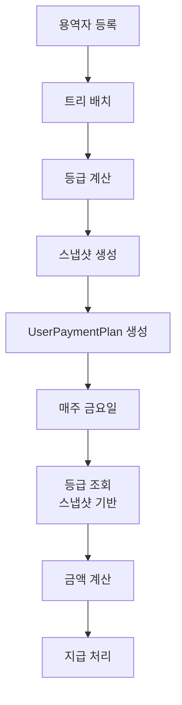

# MLM 시스템 설계 문서

**버전**: 4.0
**작성일**: 2025년 10월 4일
**최종 수정**: 2025년 10월 4일 (시스템 구조 단순화)
**시스템명**: NanumPay MLM Management System

---

## 목차

1. [시스템 개요](#1-시스템-개요)
2. [데이터베이스 설계](#2-데이터베이스-설계)
3. [API 설계](#3-api-설계)
4. [등급 계산 시스템](#4-등급-계산-시스템)
5. [지급 처리 시스템](#5-지급-처리-시스템)
6. [시스템 아키텍처](#6-시스템-아키텍처)

---

## 1. 시스템 개요

### 1.1 시스템 목적
MLM(Multi-Level Marketing) 비즈니스 모델을 지원하는 용역자 관리 및 수익 분배 시스템

### 1.2 핵심 기능
- **이진트리 구조** 기반 조직 관리
- **8단계 등급 시스템** (F1~F8)
- **자동 매출 계산** 및 **10회 분할 지급**
- **누적식 수익 배분** 방식

### 1.3 설계 원칙
- ✅ **단순화**: 불필요한 데이터 중복 제거
- ✅ **실시간성**: 월간 데이터는 API로 실시간 계산
- ✅ **일관성**: 단일 진실 원천(Single Source of Truth)
- ✅ **확장성**: 미래 요구사항 수용 가능한 구조

---

## 2. 데이터베이스 설계

### 2.1 컬렉션 구조 (단순화)

| 컬렉션명 | 용도 | 비고 |
|---------|------|------|
| **users** | 용역자 정보 + 트리 구조 | 핵심 데이터 |
| **admins** | 관리자 계정 | 별도 관리 |
| **userPaymentPlans** | 10회 분할 지급 계획 | 계획+실행 통합 |
| **treeSnapshots** | 트리 상태 스냅샷 | 등급 이력 추적 |
| **systemConfigs** | 시스템 설정값 | 등급 비율, 제한 등 |

### 2.2 상세 스키마 정의

#### 2.2.1 users 컬렉션
```javascript
{
  _id: ObjectId,

  // 계정 정보
  loginId: String,            // 고유 로그인 ID (unique index)
  passwordHash: String,       // bcrypt 해시

  // 기본 정보
  name: String,              // 성명
  phone: String,             // 연락처
  email: String,
  idNumber: String,          // 주민번호 (암호화)

  // 계좌 정보
  bank: String,              // 은행명
  accountNumber: String,     // 계좌번호

  // MLM 트리 구조
  parentId: String,          // 부모 loginId (null = 루트)
  position: String,          // 'L' | 'R'
  leftChildId: String,       // 왼쪽 자식 loginId
  rightChildId: String,      // 오른쪽 자식 loginId

  // 등급 정보
  grade: String,             // 현재 등급 (F1~F8)
  gradePaymentCount: Number, // 현 등급 누적 지급 횟수
  lastGradeChangeDate: Date,

  // 판매인 정보
  salesperson: String,       // 추천인 이름
  salespersonPhone: String,
  planner: String,          // 설계사
  plannerPhone: String,

  // 보험 정보 (F3+ 필수)
  insuranceActive: Boolean,
  insuranceAmount: Number,

  // 시스템 정보
  type: "user",
  status: String,           // 'active' | 'inactive' | 'suspended'
  createdAt: Date,         // 가입일 = 매출 귀속 기준
  updatedAt: Date
}
```

#### 2.2.2 userPaymentPlans 컬렉션
```javascript
{
  _id: ObjectId,
  userId: String,             // loginId
  revenueMonth: String,       // "2024-09" (가입월)

  // 관리자 설정
  isManualOverride: Boolean,  // 고정 금액 사용 여부
  manualTotalAmount: Number,   // 관리자 지정 총액

  // 10회 분할 상세
  installments: [{
    installmentNumber: Number,      // 회차 (1~10)
    scheduledDate: Date,            // 지급 예정일 (금요일)
    gradeReferenceDate: Date,       // 등급 기준일 (-1월 -1일)

    // 지급 시점 정보 (금요일에 채워짐)
    gradeAtPayment: String,         // 지급 시점 등급
    calculatedAmount: Number,       // 계산된 금액

    // 실지급
    withholdingTax: Number,         // 원천징수 (3.3%)
    netAmount: Number,              // 실지급액

    // 상태
    status: String,                 // 'pending' | 'paid' | 'blocked'
    blockedReason: String,          // 차단 사유
    paidDate: Date,                 // 실제 지급일
    transactionId: String           // 은행 거래 ID
  }],

  // 지급 자격
  isEligible: Boolean,
  ineligibleReason: String,

  // 집계
  totalPaidAmount: Number,
  totalPaidCount: Number,

  createdAt: Date,
  updatedAt: Date
}
```

#### 2.2.3 treeSnapshots 컬렉션
```javascript
{
  _id: ObjectId,
  snapshotDate: Date,        // 스냅샷 시점
  trigger: String,           // 'user_added' | 'grade_change' | 'daily'

  nodes: [{
    userId: String,          // loginId
    name: String,
    grade: String,           // 당시 등급
    parentId: String,
    position: String,
    leftChildId: String,
    rightChildId: String,
    insuranceActive: Boolean,
    gradePaymentCount: Number
  }],

  // 통계
  statistics: {
    totalNodes: Number,
    gradeDistribution: {
      F1: Number, F2: Number, F3: Number, F4: Number,
      F5: Number, F6: Number, F7: Number, F8: Number
    },
    maxDepth: Number
  },

  createdAt: Date
}
```

#### 2.2.4 systemConfigs 컬렉션
```javascript
{
  _id: ObjectId,
  configType: String,        // 'current' (단일 문서)

  // 등급별 비율
  gradeRatios: {
    F1: 0.24, F2: 0.19, F3: 0.14, F4: 0.09,
    F5: 0.05, F6: 0.03, F7: 0.02, F8: 0.01
  },

  // 등급별 최대 지급 횟수
  maxPaymentCounts: {
    F1: 20, F2: 30, F3: 40, F4: 40,
    F5: 50, F6: 50, F7: 60, F8: 60
  },

  // F3+ 보험 최소 금액
  minInsuranceAmounts: {
    F3: 50000, F4: 50000,
    F5: 70000, F6: 70000,
    F7: 100000, F8: 100000
  },

  // 시스템 설정
  withholdingTaxRate: 0.033,  // 원천징수율
  revenuePerUser: 1000000,    // 용역자당 매출
  installmentCount: 10,       // 분할 횟수

  updatedAt: Date,
  updatedBy: String
}
```

---

## 3. API 설계

### 3.1 용역자 관리 API

#### 3.1.1 엑셀 일괄 업로드
```javascript
// POST /api/admin/users/bulk
// Request (multipart/form-data 또는 JSON)
{
  users: [
    {
      성명: "홍길동",
      연락처: "010-1234-5678",
      은행: "국민은행",
      계좌번호: "123456789012",
      판매인: "김영희",
      날짜: "2024-09-15",
      설계사: "이철수",
      보험상품명: "종신보험",
      보험회사: "삼성생명",
      지사: "서울중앙지사"
    }
    // ...
  ]
}

// Response
{
  success: true,
  created: 10,        // 성공 건수
  failed: 0,          // 실패 건수
  errors: [],         // 오류 상세
  treeStructure: {
    totalNodes: 10,
    directPlacements: 8,   // 직접 배치
    autoPlaced: 2         // 자동 배치
  },
  alerts: [
    {
      type: "warning",
      message: "김철수: 추천인의 좌우 자리가 모두 차있어 자동 배치됨"
    }
  ]
}
```

#### 3.1.2 용역자 개별 등록
```javascript
// POST /api/admin/users/register
// Request
{
  name: "홍길동",
  phone: "010-1234-5678",
  bank: "국민은행",
  accountNumber: "123456789012",
  salesperson: "김영희",       // 추천인
  joinedAt: "2024-09-15",      // 가입일
  planner: "이철수",
  insuranceProduct: "종신보험",
  insuranceCompany: "삼성생명",
  branch: "서울중앙지사",
  // 선택적 트리 배치
  parentId: "kim123",          // 직접 지정 (옵션)
  position: "L"                // L 또는 R (옵션)
}

// Response
{
  success: true,
  user: {
    loginId: "홍길동",
    name: "홍길동",
    grade: "F1",
    parentId: "kim123",
    position: "L",
    createdAt: "2024-09-15"
  },
  treeUpdate: {
    parentGradeChanged: true,
    newParentGrade: "F2"
  }
}
```

### 3.2 트리 구조 조회 API

#### 3.2.1 사용자 트리 조회 (Depth 제한)
```javascript
// GET /api/tree/user/:userId?depth=3
// Parameters:
//   userId: 조회할 사용자 loginId
//   depth: 조회 깊이 (기본값: 2, 최대: 10)

// Response
{
  user: {
    loginId: "hong123",
    name: "홍길동",
    grade: "F3",
    level: 0              // 현재 레벨 (요청 기준점)
  },
  tree: {
    left: {
      loginId: "kim123",
      name: "김영희",
      grade: "F2",
      level: 1,
      hasChildren: true,  // 하위 노드 존재 여부
      left: {             // depth=2 이상일 때만
        loginId: "lee123",
        name: "이철수",
        grade: "F1",
        level: 2,
        hasChildren: false
      },
      right: {
        loginId: "park123",
        name: "박민수",
        grade: "F1",
        level: 2,
        hasChildren: false
      }
    },
    right: {
      loginId: "choi123",
      name: "최영수",
      grade: "F1",
      level: 1,
      hasChildren: false
    }
  },
  statistics: {
    requestedDepth: 3,
    actualDepth: 2,      // 실제 존재하는 깊이
    totalNodes: 5,
    gradeDistribution: {
      F1: 3,
      F2: 1,
      F3: 1
    }
  }
}
```

#### 3.2.2 전체 트리 구조 조회
```javascript
// GET /api/tree/full
// Response
{
  root: {
    loginId: "root",
    name: "최상위",
    grade: "F8",
    children: [/* 재귀적 구조 */]
  },
  statistics: {
    totalNodes: 150,
    maxDepth: 7,
    gradeDistribution: {
      F1: 80, F2: 40, F3: 20, F4: 7,
      F5: 2, F6: 0, F7: 0, F8: 1
    }
  }
}
```

#### 3.2.3 트리 경로 조회
```javascript
// GET /api/tree/path/:userId
// 특정 사용자까지의 경로 조회

// Response
{
  path: [
    { loginId: "root", name: "최상위", grade: "F8", level: 0 },
    { loginId: "kim123", name: "김영희", grade: "F4", level: 1, position: "L" },
    { loginId: "lee123", name: "이철수", grade: "F2", level: 2, position: "R" },
    { loginId: "hong123", name: "홍길동", grade: "F1", level: 3, position: "L" }
  ],
  depth: 3
}
```

### 3.3 월간 매출 API (실시간 계산)

```javascript
// GET /api/admin/revenue/monthly?month=2024-09
{
  month: "2024-09",
  revenue: {
    total: 10000000,        // 총 매출
    newUsers: 10,          // 신규 가입자
    perUser: 1000000       // 인당 매출
  },
  gradeDistribution: {      // 월말 기준
    F1: 50, F2: 20, F3: 10, ...
  },
  paymentProgress: {
    totalInstallments: 100,  // 총 지급 건수
    paid: 45,               // 완료
    pending: 55,            // 대기
    totalPaidAmount: 4500000
  }
}
```

### 3.4 지급 관리 API

#### 3.4.1 주간 지급 처리

```javascript
// POST /api/admin/payment/weekly
// 매주 금요일 자동 실행
{
  paymentDate: "2024-10-04",
  processed: [
    {
      userId: "user123",
      revenueMonth: "2024-09",
      installmentNumber: 1,
      amount: 100000,
      status: "paid"
    }
  ],
  summary: {
    totalProcessed: 150,
    totalAmount: 15000000,
    failed: 0
  }
}
```

#### 3.4.2 관리자 고정 금액 설정

```javascript
// POST /api/admin/payment/fixed-amounts
{
  revenueMonth: "2024-09",
  gradeAmounts: {
    F1: 50000,
    F2: 150000,
    F3: 350000
    // ...
  }
}
```

---

## 4. 등급 계산 시스템

### 4.1 등급 산정 규칙

| 등급 | 조건 |
|------|------|
| **F1** | 하위자 0~1명 |
| **F2** | 좌우 하위자 각 1명씩 |
| **F3** | 좌우 각각 F2 등급 1명 이상 |
| **F4** | 좌우 각각 F3 등급 1명 이상 |
| **F5~F8** | 전체 조직에 상위 등급 3명 이상 |

### 4.2 등급 계산 트리거

1. **용역자 등록 시** → 전체 재계산
2. **트리 구조 변경 시** → 영향받는 상위 노드 재계산
3. **일일 배치** → 전체 검증 및 재계산

---

## 5. 지급 처리 시스템

### 5.1 전체 프로세스



### 5.2 핵심 로직

#### 5.2.1 용역자 등록 시
```javascript
async function onUserRegistration(userData) {
  // 1. 용역자 생성
  const user = await User.create(userData);

  // 2. 트리 배치 (좌측 우선)
  await placeInTree(user);

  // 3. 전체 등급 재계산
  await recalculateAllGrades();

  // 4. 스냅샷 생성 (중요!)
  await createTreeSnapshot('user_added');

  // 5. 지급 계획 생성
  await createPaymentPlan(user);
}
```

#### 5.2.2 주간 지급 처리
```javascript
async function weeklyPaymentProcess(friday) {
  // 1. 대상 조회
  const targets = await UserPaymentPlan.find({
    'installments.scheduledDate': friday,
    'installments.status': 'pending'
  });

  for (const plan of targets) {
    const installment = getCurrentInstallment(plan, friday);

    // 2. 등급 확인 (스냅샷 기반)
    const grade = await getGradeFromSnapshot(
      plan.userId,
      installment.gradeReferenceDate
    );

    // 3. 금액 계산
    const amount = plan.isManualOverride
      ? plan.manualTotalAmount / 10
      : await calculateDynamicAmount(grade, plan.revenueMonth);

    // 4. 지급 처리
    await processPayment(installment, amount, grade);
  }
}
```

### 5.3 검증 및 예외 처리

#### 5.3.1 등록 검증 로직
```javascript
async function validateRegistration(userData) {
  // 1. 자기 자신을 판매인으로 등록 방지
  if (userData.salesperson === userData.name) {
    throw new Error('자기 자신을 판매인으로 등록할 수 없습니다');
  }

  // 2. 루트 노드 단일성 보장
  if (!userData.salesperson || userData.salesperson === '-') {
    const rootExists = await User.findOne({ parentId: null, type: 'user' });
    if (rootExists) {
      throw new Error('루트 노드는 이미 존재합니다');
    }
  }

  // 3. 판매인의 좌우 자리 확인
  if (userData.salesperson) {
    const sponsor = await User.findOne({ name: userData.salesperson });
    if (sponsor && sponsor.leftChildId && sponsor.rightChildId) {
      throw new Error(`${sponsor.name}님의 좌우 자리가 모두 차있어 추가할 수 없습니다`);
    }
  }
}
```

#### 5.3.2 등급 변동 시 지급액 재계산
```javascript
async function onGradeChange(userId, oldGrade, newGrade) {
  // 1. 등급 상승 시 카운터 리셋
  if (compareGrade(newGrade, oldGrade) > 0) {
    await User.updateOne(
      { loginId: userId },
      {
        $set: {
          gradePaymentCount: 0,
          lastGradeChangeDate: new Date()
        }
      }
    );
  }

  // 2. 미지급 회차들의 금액 재계산 필요 표시
  await UserPaymentPlan.updateMany(
    {
      userId,
      'installments.status': 'pending'
    },
    {
      $set: { 'installments.$[elem].needsRecalculation': true }
    },
    {
      arrayFilters: [{ 'elem.status': 'pending' }]
    }
  );

  // 3. 스냅샷 생성
  await createTreeSnapshot('grade_change');
}
```

### 5.4 동적 금액 계산

```javascript
async function calculateDynamicAmount(grade, revenueMonth) {
  // 1. 해당 월 총매출 (실시간 계산)
  const revenue = await getMonthlyRevenue(revenueMonth);

  // 2. 등급별 인원 (스냅샷 기반)
  const distribution = await getGradeDistribution(revenueMonth);

  // 3. 누적 방식 계산
  const amount = calculateCumulativeAmount(
    grade,
    revenue,
    distribution
  );

  return amount / 10; // 10회 분할
}

// 누적식 배분 상세 알고리즘
function calculateCumulativeAmount(grade, totalRevenue, distribution) {
  const ratios = {
    F1: 0.24, F2: 0.19, F3: 0.14, F4: 0.09,
    F5: 0.05, F6: 0.03, F7: 0.02, F8: 0.01
  };

  const grades = ['F1', 'F2', 'F3', 'F4', 'F5', 'F6', 'F7', 'F8'];
  const gradeIndex = grades.indexOf(grade);

  // F1 기본 금액 계산
  const f1Count = distribution.F1 || 0;
  const f2Count = distribution.F2 || 0;
  const f1Amount = (totalRevenue * ratios.F1) / (f1Count + f2Count) || 0;

  if (grade === 'F1') return Math.floor(f1Amount);

  // 누적 계산
  let accumulatedAmount = f1Amount;

  for (let i = 1; i <= gradeIndex; i++) {
    const currentGrade = grades[i];
    const prevGrade = grades[i - 1];
    const nextGrade = grades[i + 1];

    const currentCount = distribution[currentGrade] || 0;
    const nextCount = distribution[nextGrade] || 0;

    const additionalAmount = (totalRevenue * ratios[currentGrade]) /
                            (currentCount + nextCount) || 0;

    accumulatedAmount += additionalAmount;
  }

  return Math.floor(accumulatedAmount);
}

---

## 6. 시스템 아키텍처

### 6.1 계층 구조

```
┌─────────────────────────────────┐
│      Frontend (SvelteKit)       │
├─────────────────────────────────┤
│         API Layer               │
│  - 월간 매출 (실시간 계산)       │
│  - 주간 지급 처리               │
│  - 관리자 설정                  │
├─────────────────────────────────┤
│      Business Logic             │
│  - 등급 계산                    │
│  - 트리 관리                    │
│  - 지급 처리                    │
├─────────────────────────────────┤
│      Data Layer (MongoDB)       │
│  - users                        │
│  - userPaymentPlans             │
│  - treeSnapshots                │
│  - systemConfigs                │
└─────────────────────────────────┘
```

### 6.2 주요 개선 사항

1. **컬렉션 감소**: 7개 → 5개
2. **데이터 중복 제거**: 월간 매출 실시간 계산
3. **관리 단순화**: UserPaymentPlan으로 통합
4. **성능 향상**: 인덱스 최적화

### 6.3 인덱스 전략

```javascript
// users
{ loginId: 1 }  // unique
{ parentId: 1 }
{ grade: 1 }
{ createdAt: -1 }

// userPaymentPlans
{ userId: 1, revenueMonth: 1 }  // compound
{ 'installments.scheduledDate': 1 }
{ 'installments.status': 1 }

// treeSnapshots
{ snapshotDate: -1 }
{ 'nodes.userId': 1 }
```

---

### 3.5 사용자 조회 API

#### 3.5.1 사용자 상세 조회
```javascript
// GET /api/users/:userId
// Response
{
  user: {
    loginId: "hong123",
    name: "홍길동",
    grade: "F2",
    phone: "010-1234-5678",
    bank: "국민은행",
    accountNumber: "123456789012",
    createdAt: "2024-09-15"
  },
  treeInfo: {
    parentId: "kim123",
    parentName: "김영희",
    position: "L",
    leftChild: { loginId: "lee123", name: "이철수" },
    rightChild: { loginId: "park123", name: "박민수" }
  },
  paymentInfo: {
    currentGradePaymentCount: 15,
    maxPaymentCount: 30,
    remainingPayments: 15,
    totalReceived: 1500000
  },
  insuranceInfo: {
    active: true,
    amount: 50000,
    meetsRequirement: true
  }
}
```

---

## 부록: 변경 이력

### v4.0 (2025-10-04)
- monthlyRevenues 컬렉션 제거 → API 실시간 계산
- weeklyPayments 제거 → userPaymentPlans 통합
- 스냅샷 생성 빈도 증가 (용역자 추가 시마다)
- 시스템 구조 단순화
- API 명세 추가 (엑셀 업로드, 트리 조회, 사용자 조회)
- 검증 로직 추가 (자기 판매인 방지, 루트 단일성, 좌우 차단)
- 등급 변동 시 지급액 재계산 프로세스 추가
- 누적식 배분 상세 알고리즘 구현

### v3.0 (2025-10-03)
- 동적 등급 기준 적용
- 스냅샷 시스템 도입
- 지급 프로세스 개선

---

**문서 끝**