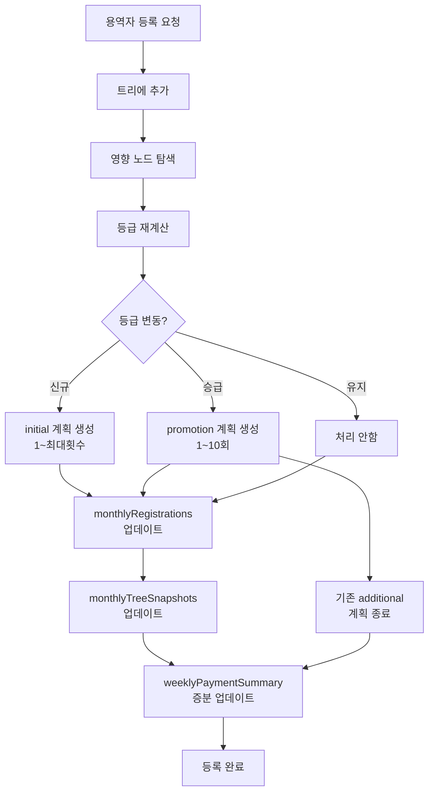
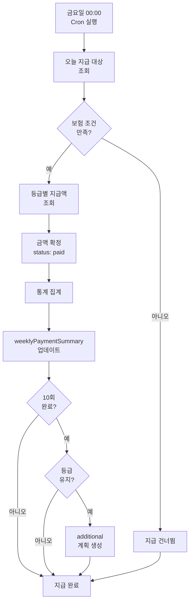
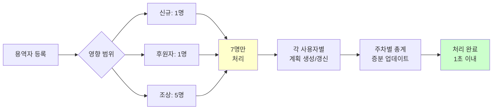

# MLM 시스템 설계 문서 v5.0

**버전**: 5.0
**작성일**: 2025년 10월 11일
**기준 요구사항**: 시스템_요구사항_검토문서 v3.0

**주요 변경사항 (v5.0)**:
- 승급 시 기존 지급 병행 처리 (기존 중단하지 않음)
- 추가 지급기간 개념 도입 (등급별 최대 수령 횟수)
- 주차별 지급 총계 컬렉션 추가 (성능 최적화)
- 증분 업데이트 전략 (전체 재계산 불필요)

---

## 📋 목차

1. [시스템 개요](#1-시스템-개요)
2. [데이터베이스 설계](#2-데이터베이스-설계)
3. [지급 계획 처리 방안](#3-지급-계획-처리-방안)
4. [자동화 프로세스](#4-자동화-프로세스)
5. [웹 API 설계](#5-웹-api-설계)
6. [데이터 흐름도](#6-데이터-흐름도)

---

## 1. 시스템 개요

### 1.1 핵심 원칙

**v3.0 요구사항 기반 설계 원칙**:

1. **병행 지급**: 승급 시 기존 지급 중단하지 않고 새 지급 추가
2. **추가 지급기간**: 10회 완료 후 등급별 최대 횟수까지 추가 지급
3. **증분 업데이트**: 영향받는 사용자만 처리 (전체 재계산 불필요)
4. **미래 예측**: 용역자 등록 시 전체 지급 계획 사전 생성
5. **주간 집계**: 금요일마다 자동 지급 처리 및 통계 업데이트

### 1.2 시스템 구성도

```
[용역자 등록]
    ↓
[트리/등급 재계산] ← 영향받는 사용자만
    ↓
[지급계획 생성/갱신]
    ↓
[주차별 총계 업데이트] ← 미래 예측
    ↓
[매주 금요일 자동 지급]
    ↓
[통계 증분 업데이트]
```

---

## 2. 데이터베이스 설계

### 2.1 컬렉션 개요

전체 **4개 핵심 컬렉션** 구성:

| 컬렉션명 | 목적 | 업데이트 시점 | 조회 빈도 |
|---------|------|--------------|----------|
| **monthlyRegistrations** | 월별 등록/매출 관리 | 용역자 등록 시 | 낮음 |
| **monthlyTreeSnapshots** | 월별 계층도/등급 확정 | 등록 시 + 월말 | 중간 |
| **weeklyPaymentPlans** | 개별 지급 계획 | 등록/승급 시 | 높음 |
| **weeklyPaymentSummary** | 주차별 총계 (통계) | 등록/지급 시 | 매우 높음 |

---

### 2.2 컬렉션 상세 설계

#### 2.2.1 monthlyRegistrations (월별 등록 관리)

**목적**: 매월 용역자 등록 및 매출 관리

```javascript
{
  _id: ObjectId,
  monthKey: String,              // "2025-10" (YYYY-MM)

  // 등록 정보
  registrationCount: Number,     // 해당 월 등록 인원
  totalRevenue: Number,          // 총매출 (인원 × 100만원)
  adjustedRevenue: Number,       // 관리자 수동 조정 금액 (null이면 자동)

  // 등록자 목록
  registrations: [{
    userId: String,
    userName: String,
    registrationDate: Date,      // 실제 등록일
    sponsorId: String,           // 후원자
    grade: String,               // 등록 시점 등급
    position: String             // 'left' | 'right' | 'root'
  }],

  // 등급별 분포 (월말 기준)
  gradeDistribution: {
    F1: Number,
    F2: Number,
    F3: Number,
    F4: Number,
    F5: Number,
    F6: Number,
    F7: Number,
    F8: Number
  },

  // 등급별 지급액 (해당 월 매출 기준)
  gradePayments: {
    F1: Number,  // 예: 40,000
    F2: Number,  // 예: 175,714
    F3: Number,  // 예: 409,047
    F4: Number,
    F5: Number,
    F6: Number,
    F7: Number,
    F8: Number
  },

  createdAt: Date,
  updatedAt: Date
}

// 인덱스
monthlyRegistrations.createIndex({ monthKey: 1 }, { unique: true })
monthlyRegistrations.createIndex({ 'registrations.userId': 1 })
```

**용도**:
- 월별 매출 계산
- 등급별 지급액 산정
- 관리자 수동 매출 조정

---

#### 2.2.2 monthlyTreeSnapshots (월별 계층도 스냅샷)

**목적**: 월별 계층도 및 등급 확정

```javascript
{
  _id: ObjectId,
  monthKey: String,              // "2025-10"
  snapshotDate: Date,            // 스냅샷 생성 일시
  totalUsers: Number,            // 전체 용역자 수

  // 사용자 스냅샷
  users: [{
    userId: String,
    userName: String,
    grade: String,               // 해당 월 확정 등급
    registrationDate: Date,

    // 트리 구조
    sponsorId: String,
    leftChildId: String,
    rightChildId: String,
    leftSubtreeCount: Number,
    rightSubtreeCount: Number,
    depth: Number,
    position: String,            // 'left' | 'right' | 'root'

    // 보험 조건 (F3 이상)
    insuranceRequired: Boolean,
    insuranceAmount: Number,
    insuranceMaintained: Boolean, // 보험 유지 여부

    // 활성 지급 계획 정보
    activePaymentPlans: [{
      planId: ObjectId,
      planType: String,          // 'initial' | 'promotion' | 'additional'
      baseGrade: String,
      startMonth: String,        // 지급 시작 월
      currentInstallment: Number,
      totalInstallments: Number,
      status: String             // 'active' | 'completed'
    }]
  }],

  // 통계
  gradeDistribution: {
    F1: Number,
    F2: Number,
    F3: Number,
    F4: Number,
    F5: Number,
    F6: Number,
    F7: Number,
    F8: Number
  },

  createdAt: Date
}

// 인덱스
monthlyTreeSnapshots.createIndex({ monthKey: 1 }, { unique: true })
monthlyTreeSnapshots.createIndex({ 'users.userId': 1 })
monthlyTreeSnapshots.createIndex({ 'users.grade': 1 })
```

**용도**:
- 지급 시 등급 참조 (월말 기준 등급 사용)
- 과거 계층도 복원
- 감사 추적

**업데이트 시점**:
- 용역자 등록 시 즉시 업데이트 (실시간 반영)
- 매월 말일 최종 확정 스냅샷 생성

---

#### 2.2.3 weeklyPaymentPlans (개별 지급 계획)

**목적**: 용역자별 주차별 지급 계획 상세

```javascript
{
  _id: ObjectId,
  userId: String,
  userName: String,

  // 계획 정보
  planType: String,              // 'initial' | 'promotion' | 'additional'
  baseGrade: String,             // F1~F8
  revenueMonth: String,          // 매출 귀속 월 "2025-10"

  // 지급 정보
  startDate: Date,               // 지급 시작일 (등록일+1개월 후 첫 금요일)
  totalInstallments: Number,     // 총 지급 횟수
  completedInstallments: Number, // 완료된 지급 횟수

  // 주차별 지급 내역
  installments: [{
    week: Number,                // 1~60 (등급별 최대)
    weekNumber: String,          // "2025-W41" (ISO 주차)
    scheduledDate: Date,         // 지급 예정일 (금요일)

    revenueMonth: String,        // 매출 귀속 월
    gradeAtPayment: String,      // 지급 시점 등급 (월말 스냅샷 기준)

    // 금액 (주간 지급 시 확정)
    baseAmount: Number,          // null → 확정 (등급별 지급액)
    installmentAmount: Number,   // 회차당 지급액
    withholdingTax: Number,      // 원천징수 (3.3%)
    netAmount: Number,           // 실지급액

    status: String,              // 'pending' | 'paid' | 'terminated'
    paidAt: Date,                // 실제 지급 일시

    // 지급 타입
    installmentType: String      // 'initial' (1~10회) | 'additional' (11회~)
  }],

  planStatus: String,            // 'active' | 'completed' | 'terminated'

  // 메타데이터
  createdAt: Date,
  updatedAt: Date,
  terminatedAt: Date,
  terminationReason: String      // 'promotion' | 'max_reached' | 'manual'
}

// 인덱스
weeklyPaymentPlans.createIndex({ userId: 1, planStatus: 1 })
weeklyPaymentPlans.createIndex({ 'installments.scheduledDate': 1, 'installments.status': 1 })
weeklyPaymentPlans.createIndex({ planType: 1, baseGrade: 1 })
weeklyPaymentPlans.createIndex({ revenueMonth: 1 })
```

**planType 구분**:
- `initial`: 등록 시 생성 (1회~최대 횟수)
- `promotion`: 승급 시 생성 (1~10회만)
- `additional`: 10회 완료 후 생성 (11회~최대 횟수)

**특징**:
- 한 사용자가 **여러 계획 동시 보유 가능** (병행 지급)
- 미래 지급까지 사전 생성 (예측 가능)

---

#### 2.2.4 weeklyPaymentSummary (주차별 총계)

**목적**: 주차별 전체 지급 통계 (성능 최적화)

```javascript
{
  _id: ObjectId,
  weekDate: Date,                // 금요일 날짜 (2025-10-11)
  weekNumber: String,            // "2025-W41" (ISO 주차)
  monthKey: String,              // "2025-10"

  // 전체 총계 (페이지 무관)
  totalAmount: Number,           // 전체 지급액 합계
  totalTax: Number,              // 전체 원천징수 합계
  totalNet: Number,              // 전체 실지급액 합계
  totalUserCount: Number,        // 전체 지급 대상 인원
  totalPaymentCount: Number,     // 전체 지급 건수 (병행지급 포함)

  // 등급별 총계
  byGrade: {
    F1: {
      amount: Number,
      tax: Number,
      net: Number,
      userCount: Number,
      paymentCount: Number
    },
    F2: { ... },
    F3: { ... },
    F4: { ... },
    F5: { ... },
    F6: { ... },
    F7: { ... },
    F8: { ... }
  },

  // 계획 타입별 총계
  byPlanType: {
    initial: {
      amount: Number,
      tax: Number,
      net: Number,
      paymentCount: Number
    },
    promotion: { ... },
    additional: { ... }
  },

  status: String,                // 'scheduled' | 'completed'
  processedAt: Date,

  createdAt: Date,
  updatedAt: Date
}

// 인덱스
weeklyPaymentSummary.createIndex({ weekNumber: 1 }, { unique: true })
weeklyPaymentSummary.createIndex({ weekDate: 1 })
weeklyPaymentSummary.createIndex({ monthKey: 1 })
```

**용도**:
- 웹 UI 전체 총계 표시 (< 1ms 조회)
- 미래 지급 예측 조회
- 대시보드 통계

**업데이트 시점**:
- 용역자 등록 시: 증분 업데이트 (미래 예측 반영)
- 매주 금요일: 실제 지급 결과 업데이트
- 승급 시: 차감/추가 업데이트

---

## 3. 지급 계획 처리 방안

### 3.1 처리 시나리오 별 전략

#### 3.1.1 신규 등록 시

**처리 흐름**:
```
1. 트리에 사용자 추가
2. 등급 재계산 (영향받는 사용자만)
3. 등급 변동자에 대해:
   - 신규 사용자: initial 계획 생성 (1~최대 횟수)
   - 승급자: promotion 계획 생성 (1~10회)
4. monthlyTreeSnapshots 업데이트
5. weeklyPaymentSummary 증분 업데이트
```

**예시**:
```
7월 2일: 홍길동 등록 (F1)
→ initial 계획 생성: 1~20회 (F1 최대 20회)
→ 8월 첫 금요일부터 지급 시작
```

---

#### 3.1.2 승급 시 (병행 지급)

**처리 흐름**:
```
1. 기존 계획 처리:
   - initial/promotion 계획: 유지 (계속 지급)
   - additional 계획: 종료 (terminated)
2. 새 promotion 계획 생성 (1~10회)
3. weeklyPaymentSummary 차감/추가
```

**예시**:
```
7월 2일: F1 등록 → initial 계획 생성 (1~20회)
8월 4일: F1 1회 지급
8월 11일: F1 2회 지급
8월 18일: F1 3회 지급

8월 20일: F3 승급! ⭐
→ F1 initial 계획: 유지 (4~10회 계속)
→ F3 promotion 계획 생성 (1~10회)
→ 9월부터 병행 지급 시작

9월 1일: F1 4회 + F3 1회 = 병행 지급
9월 8일: F1 5회 + F3 2회 = 병행 지급
...
10월 13일: F1 10회 (완료) + F3 7회
10월 20일: F3 8회 (F3만 지급)
```

---

#### 3.1.3 추가 지급기간 (10회 완료 후)

**처리 흐름**:
```
1. initial/promotion 계획 10회 완료 확인
2. 현재 등급 확인
3. 등급 유지 시:
   - additional 계획 생성 (11~최대 횟수)
4. 등급 변동 시:
   - 생성하지 않음 (이미 promotion 계획 존재)
```

**예시**:
```
F2 등록 → initial 10회 완료
→ 등급 유지 시: additional 계획 생성 (11~30회)
→ F4 승급 시: 생성 안함 (F4 promotion 진행 중)
```

---

### 3.2 등급별 최대 수령 횟수

| 등급 | 최대 횟수 | 구성 |
|------|----------|------|
| F1 | 20회 | 기본 10회 + 추가 10회 |
| F2 | 30회 | 기본 10회 + 추가 20회 |
| F3 | 40회 | 기본 10회 + 추가 30회 |
| F4 | 40회 | 기본 10회 + 추가 30회 |
| F5 | 50회 | 기본 10회 + 추가 40회 |
| F6 | 50회 | 기본 10회 + 추가 40회 |
| F7 | 60회 | 기본 10회 + 추가 50회 |
| F8 | 60회 | 기본 10회 + 추가 50회 |

---

### 3.3 지급 계획 생성 로직

#### 3.3.1 Initial 계획 생성 (등록 시)

```javascript
async function createInitialPaymentPlan(userId, grade, revenueMonth) {
  const maxCounts = {
    F1: 20, F2: 30, F3: 40, F4: 40,
    F5: 50, F6: 50, F7: 60, F8: 60
  };

  const user = await User.findById(userId);
  const startDate = getFirstFridayAfterOneMonth(user.registrationDate);
  const maxCount = maxCounts[grade];

  const installments = [];
  for (let i = 1; i <= maxCount; i++) {
    const scheduledDate = addWeeks(startDate, i - 1);

    installments.push({
      week: i,
      weekNumber: getISOWeek(scheduledDate),
      scheduledDate,
      revenueMonth,
      gradeAtPayment: null,

      baseAmount: null,
      installmentAmount: null,
      withholdingTax: null,
      netAmount: null,

      status: 'pending',
      installmentType: i <= 10 ? 'initial' : 'additional'
    });
  }

  const plan = await WeeklyPaymentPlan.create({
    userId,
    userName: user.name,
    planType: 'initial',
    baseGrade: grade,
    revenueMonth,
    startDate,
    totalInstallments: maxCount,
    completedInstallments: 0,
    installments,
    planStatus: 'active'
  });

  // 주차별 총계 업데이트 (미래 예측 반영)
  await updateWeeklyProjections(plan, 'add');

  return plan;
}
```

---

#### 3.3.2 Promotion 계획 생성 (승급 시)

```javascript
async function createPromotionPaymentPlan(userId, newGrade, revenueMonth) {
  const user = await User.findById(userId);

  // 1. 기존 additional 계획 종료
  await terminateAdditionalPlans(userId);

  // 2. 승급월 다음달 첫 금요일부터 시작
  const promotionMonth = getCurrentMonthKey();
  const nextMonth = getNextMonth(promotionMonth);
  const startDate = getFirstFridayOfMonth(nextMonth);

  const installments = [];
  for (let i = 1; i <= 10; i++) {  // 승급은 10회만
    const scheduledDate = addWeeks(startDate, i - 1);

    installments.push({
      week: i,
      weekNumber: getISOWeek(scheduledDate),
      scheduledDate,
      revenueMonth,
      gradeAtPayment: null,

      baseAmount: null,
      installmentAmount: null,
      withholdingTax: null,
      netAmount: null,

      status: 'pending',
      installmentType: 'initial'  // 승급도 기본 10회
    });
  }

  const plan = await WeeklyPaymentPlan.create({
    userId,
    userName: user.name,
    planType: 'promotion',
    baseGrade: newGrade,
    revenueMonth,
    startDate,
    totalInstallments: 10,
    completedInstallments: 0,
    installments,
    planStatus: 'active'
  });

  // 주차별 총계 업데이트
  await updateWeeklyProjections(plan, 'add');

  return plan;
}
```

---

#### 3.3.4 지급액 계산 및 100원 단위 절삭

```javascript
async function calculateInstallmentAmount(baseGrade, revenueMonth, installmentCount = 10) {
  // 1. 월별 매출 및 등급별 지급액 조회
  const monthlyReg = await MonthlyRegistration.findOne({ monthKey: revenueMonth });
  const revenue = monthlyReg.adjustedRevenue || monthlyReg.totalRevenue;

  // 2. 등급별 개인 지급액 계산 (누적 방식)
  const gradePayments = calculateGradePayments(revenue, monthlyReg.gradeDistribution);
  const baseAmount = gradePayments[baseGrade];

  // 3. 10분할 시 100원 단위 절삭
  const installmentAmount = Math.floor(baseAmount / installmentCount / 100) * 100;

  // 4. 원천징수 계산
  const withholdingTax = Math.round(installmentAmount * 0.033);
  const netAmount = installmentAmount - withholdingTax;

  return {
    baseAmount,        // 등급별 총 지급액 (절삭 전)
    installmentAmount, // 회차당 지급액 (100원 단위 절삭)
    withholdingTax,    // 원천징수액
    netAmount          // 실지급액
  };
}

// 등급별 누적 지급액 계산
function calculateGradePayments(totalRevenue, gradeDistribution) {
  const rates = {
    F1: 0.24, F2: 0.19, F3: 0.14, F4: 0.09,
    F5: 0.05, F6: 0.03, F7: 0.02, F8: 0.01
  };

  const payments = {};
  let previousAmount = 0;

  const grades = ['F1', 'F2', 'F3', 'F4', 'F5', 'F6', 'F7', 'F8'];

  for (let i = 0; i < grades.length; i++) {
    const grade = grades[i];
    const nextGrade = grades[i + 1];

    const currentCount = gradeDistribution[grade] || 0;
    const nextCount = gradeDistribution[nextGrade] || 0;

    if (currentCount > 0) {
      const poolAmount = totalRevenue * rates[grade];
      const poolCount = currentCount + nextCount;

      if (poolCount > 0) {
        const additionalPerPerson = poolAmount / poolCount;
        payments[grade] = previousAmount + additionalPerPerson;
        previousAmount = payments[grade];
      } else {
        payments[grade] = previousAmount;
      }
    } else {
      payments[grade] = 0;
    }
  }

  return payments;
}
```

---

#### 3.3.5 Additional 계획 생성 (10회 완료 후 등급 유지 시)

```javascript
async function createAdditionalPaymentPlan(userId, currentGrade, lastPlan) {
  const maxCounts = {
    F1: 20, F2: 30, F3: 40, F4: 40,
    F5: 50, F6: 50, F7: 60, F8: 60
  };

  const user = await User.findById(userId);
  const maxCount = maxCounts[currentGrade];

  // 이미 수령한 회차 확인
  const completedCount = lastPlan.completedInstallments;

  // 남은 회차가 있는지 확인
  if (completedCount >= maxCount) {
    console.log(`User ${userId} reached max count for grade ${currentGrade}`);
    return null;
  }

  // Additional 계획 생성 (11회차부터)
  const remainingCount = maxCount - 10; // 추가 지급 가능 횟수
  const installments = [];

  const lastInstallment = lastPlan.installments[9]; // 10회차
  const nextFriday = addWeeks(lastInstallment.scheduledDate, 1);

  for (let i = 11; i <= maxCount; i++) {
    const scheduledDate = addWeeks(nextFriday, i - 11);

    installments.push({
      week: i,
      weekNumber: getISOWeek(scheduledDate),
      scheduledDate,
      revenueMonth: lastPlan.revenueMonth, // 동일 매출월 기준
      gradeAtPayment: null,

      baseAmount: null,
      installmentAmount: null,
      withholdingTax: null,
      netAmount: null,

      status: 'pending',
      installmentType: 'additional'
    });
  }

  const additionalPlan = await WeeklyPaymentPlan.create({
    userId,
    userName: user.name,
    planType: 'additional',
    baseGrade: currentGrade,
    revenueMonth: lastPlan.revenueMonth,
    startDate: nextFriday,
    totalInstallments: remainingCount,
    completedInstallments: 0,
    installments,
    planStatus: 'active'
  });

  // 주차별 총계 업데이트
  await updateWeeklyProjections(additionalPlan, 'add');

  return additionalPlan;
}

// 매주 금요일 지급 처리 후 호출
async function checkAndCreateAdditionalPlan(plan) {
  // 10회차 완료 확인
  if (plan.completedInstallments === 10 &&
      plan.planType !== 'additional') {

    // 현재 등급 확인
    const currentSnapshot = await MonthlyTreeSnapshot.findOne({
      monthKey: getCurrentMonthKey(),
      'users.userId': plan.userId
    });

    const userSnapshot = currentSnapshot.users.find(u => u.userId === plan.userId);
    const currentGrade = userSnapshot.grade;

    // 등급 유지 여부 확인
    if (currentGrade === plan.baseGrade) {
      // 등급 유지 시 additional 계획 생성
      await createAdditionalPaymentPlan(plan.userId, currentGrade, plan);
    }
    // 승급한 경우 이미 promotion 계획이 있으므로 생성 안함
  }
}
```

---

#### 3.3.3 Additional 계획 종료 (승급 시)

```javascript
async function terminateAdditionalPlans(userId) {
  const additionalPlans = await WeeklyPaymentPlan.find({
    userId,
    planStatus: 'active',
    'installments.installmentType': 'additional'
  });

  for (const plan of additionalPlans) {
    for (const inst of plan.installments) {
      if (inst.installmentType === 'additional' && inst.status === 'pending') {
        inst.status = 'terminated';
      }
    }

    plan.planStatus = 'terminated';
    plan.terminatedAt = new Date();
    plan.terminationReason = 'promotion';

    await plan.save();

    // 주차별 총계에서 제거
    await updateWeeklyProjections(plan, 'remove');
  }
}
```

---

## 4. 자동화 프로세스

### 4.1 용역자 등록 시 자동 처리

```
[용역자 등록 요청]
    ↓
[1. 트리에 사용자 추가]
    ↓
[2. 영향받는 노드 탐색]
   - 신규 사용자
   - 후원자
   - 조상 노드들
    ↓
[3. 등급 재계산] (영향받는 사용자만)
    ↓
[4. 등급 변동 확인]
   ├─ 신규: initial 계획 생성
   ├─ 승급: promotion 계획 생성 + additional 종료
   └─ 유지: 처리 안함
    ↓
[5. monthlyRegistrations 업데이트]
   - 등록자 추가
   - 매출 재계산
   - 등급별 지급액 재계산
    ↓
[6. monthlyTreeSnapshots 업데이트 (upsert)]
   - 현재 월 스냅샷 업데이트 (없으면 생성)
   - 트리 구조 반영
   - 활성 계획 정보 반영
   - 실시간 최신 상태 유지
    ↓
[7. weeklyPaymentSummary 증분 업데이트]
   - 신규 계획: 미래 주차에 증가 반영
   - 종료 계획: 미래 주차에서 차감
    ↓
[등록 완료]
```

**처리 시간**: 약 500ms~1초 (10,000명 규모)

---

### 4.2 매주 금요일 자동 지급 처리

```
[매주 금요일 00:00 Cron 실행]
    ↓
[1. 오늘 지급 대상 조회]
   weeklyPaymentPlans.find({
     'installments.scheduledDate': today,
     'installments.status': 'pending'
   })
    ↓
[2. 각 지급 건 처리]
   ├─ 매출월 스냅샷에서 등급 확인
   ├─ 보험 조건 확인 (F3 이상)
   ├─ 등급별 지급액 조회
   ├─ 금액 확정 (baseAmount, installmentAmount, tax, net)
   └─ status: 'pending' → 'paid'
    ↓
[3. 통계 집계]
   - 총 지급액 합산
   - 등급별 집계
   - 계획 타입별 집계
    ↓
[4. weeklyPaymentSummary 업데이트]
   - totalAmount, totalTax, totalNet
   - byGrade 업데이트
   - status: 'completed'
    ↓
[5. 10회 완료 확인]
   - initial/promotion 계획 10회 완료 시
   - 등급 유지 확인
   - additional 계획 생성 (필요 시)
    ↓
[지급 처리 완료]
```

**Cron 설정**: `0 0 * * 5` (매주 금요일 00:00)

**처리 시간**: 약 2~5초 (2,000~3,000건 지급 기준)

#### 4.2.1 보험 조건 검증 처리

**관리자 설정 기반 보험 조건 관리**:

```javascript
async function processWeeklyPayment(date) {
  const pendingInstallments = await WeeklyPaymentPlan.find({
    'installments.scheduledDate': date,
    'installments.status': 'pending'
  });

  for (const plan of pendingInstallments) {
    const user = await User.findById(plan.userId);
    const grade = plan.baseGrade;

    // 1. F3 이상 등급의 보험 조건 확인
    if (grade >= 'F3') {
      // 관리자가 설정한 보험 조건 조회
      const insuranceSettings = user.insuranceSettings;

      if (insuranceSettings && insuranceSettings.required) {
        // 보험 유지 여부 확인 (관리자가 설정한 상태)
        if (!insuranceSettings.maintained) {
          // 보험 미유지 시 해당 회차 건너뜀
          inst.status = 'skipped';
          inst.skipReason = 'insurance_not_maintained';
          continue;
        }

        // 보험 금액 조건 확인
        const requiredAmounts = {
          F3: 50000, F4: 50000,
          F5: 70000, F6: 70000,
          F7: 100000, F8: 100000
        };

        if (insuranceSettings.amount < requiredAmounts[grade]) {
          inst.status = 'skipped';
          inst.skipReason = 'insufficient_insurance_amount';
          continue;
        }
      }
    }

    // 2. 지급 처리
    const amounts = await calculateInstallmentAmount(grade, plan.revenueMonth);
    inst.baseAmount = amounts.baseAmount;
    inst.installmentAmount = amounts.installmentAmount;
    inst.withholdingTax = amounts.withholdingTax;
    inst.netAmount = amounts.netAmount;
    inst.status = 'paid';
    inst.paidAt = new Date();
  }
}
```

**관리자 보험 설정 UI**:

```javascript
// 용역자 편집 화면에서 보험 설정
{
  userId: "user123",
  insuranceSettings: {
    required: true,           // F3 이상 자동 활성화
    amount: 70000,            // 관리자가 입력한 보험금액
    maintained: true,         // 관리자가 설정한 유지 상태
    lastUpdated: Date,        // 마지막 수정일
    updatedBy: "admin123"     // 수정한 관리자
  },

  // 보험 이력 추적 (재가입 시 기존 회수 유지용)
  insuranceHistory: [{
    period: "2025-01",
    maintained: true,
    amount: 50000
  }, {
    period: "2025-02",
    maintained: false,        // 해지
    amount: 0
  }, {
    period: "2025-03",
    maintained: true,         // 재가입
    amount: 50000
  }]
}
```

#### 4.2.2 보험 재가입 시 회수 유지 처리

**보험 해지 및 재가입 시나리오**:

```javascript
async function handleInsuranceStatusChange(userId, newStatus, amount) {
  const user = await User.findById(userId);
  const currentMonth = getCurrentMonthKey();

  // 1. 보험 상태 변경 기록
  user.insuranceSettings.maintained = newStatus;
  user.insuranceSettings.amount = amount;
  user.insuranceSettings.lastUpdated = new Date();

  // 2. 이력 추가
  user.insuranceHistory.push({
    period: currentMonth,
    maintained: newStatus,
    amount: amount
  });

  // 3. 활성 지급 계획 조회
  const activePlans = await WeeklyPaymentPlan.find({
    userId: userId,
    planStatus: 'active'
  });

  for (const plan of activePlans) {
    // 보험 해지 시: 지급은 건너뛰지만 회차는 계속 진행
    // 보험 재가입 시: 기존 회차부터 재개

    if (!newStatus) {
      // 보험 해지 - 향후 지급 건너뜀 표시
      for (const inst of plan.installments) {
        if (inst.status === 'pending' && inst.scheduledDate > new Date()) {
          inst.insuranceSkipped = true; // 건너뜀 표시만, status는 그대로
        }
      }
    } else {
      // 보험 재가입 - 건너뜀 표시 제거 (기존 회차 유지)
      for (const inst of plan.installments) {
        if (inst.insuranceSkipped && inst.status === 'pending') {
          delete inst.insuranceSkipped; // 다시 지급 대상으로
        }
      }
    }
  }

  await user.save();
}

// 실제 지급 처리 시
async function processPaymentWithInsurance(installment, user) {
  // insuranceSkipped 플래그 확인
  if (installment.insuranceSkipped) {
    installment.status = 'skipped';
    installment.skipReason = 'insurance_not_maintained';

    // 회차는 증가하지만 지급은 안함
    plan.completedInstallments++; // 회차는 계속 카운트
    return;
  }

  // 정상 지급 처리
  // ...
}
```

**예시 시나리오**:

```
1월: F3, 보험 유지 → 1~3회차 정상 지급
2월: 보험 해지 → 4~6회차 건너뜀 (회차는 진행)
3월: 보험 재가입 → 7회차부터 다시 지급 (회차 연속성 유지)
4월: 10회차 완료 → 추가 지급 11회차부터 계속

→ 보험 해지 기간에도 회차는 계속 진행되어 재가입 시 기존 회차 유지
```

---

### 4.3 monthlyTreeSnapshots 관리 및 월말 등급 확정

**월말 등급 확정 원칙**:

```
용역자 등록 시마다 monthlyTreeSnapshots가 업데이트되어
해당 월의 마지막 시점까지 계속 반영됨
→ 월말 시점의 스냅샷이 자연스럽게 그 월의 확정 등급이 됨
```

**업데이트 프로세스**:

```
[용역자 등록]
    ↓
[트리/등급 재계산]
    ↓
[현재 월 monthlyTreeSnapshots 업데이트 (upsert)]
   - 스냅샷 없으면: 생성
   - 스냅샷 있으면: 업데이트
   - 최신 등급 정보 반영
    ↓
[월말까지 계속 최신 상태 유지]
    ↓
[다음 월 1일 00:00]
   - 이전 월 스냅샷 자동 확정 (더 이상 수정 안됨)
   - 새로운 월 스냅샷 생성 시작
```

**등급 참조 로직**:

```javascript
async function getConfirmedGradeForPayment(userId, revenueMonth) {
  // 매출 발생 월의 스냅샷에서 등급 조회
  // 예: 7월 매출 → 7월 말 스냅샷의 등급 사용
  const snapshot = await MonthlyTreeSnapshot.findOne({
    monthKey: revenueMonth,
    'users.userId': userId
  });

  const userSnapshot = snapshot.users.find(u => u.userId === userId);
  return userSnapshot.grade; // 이것이 확정 등급
}

// 지급 처리 시 사용
async function processPayment(installment, plan) {
  // 매출월의 확정 등급으로 지급액 계산
  const confirmedGrade = await getConfirmedGradeForPayment(
    plan.userId,
    installment.revenueMonth
  );

  // 이 등급으로 10회 모두 동일하게 지급
  const amounts = await calculateInstallmentAmount(
    confirmedGrade,
    installment.revenueMonth
  );
}
```

**특징**:
- 별도 월말 스냅샷 생성 Cron 불필요
- 용역자 등록할 때마다 자동 업데이트
- 월이 바뀌면 이전 월은 자동으로 확정 상태
- 지급 시 항상 매출월의 확정 등급 참조

---

## 5. 웹 API 설계

### 5.1 용역비 지급명부 API

#### 5.1.1 주차별 지급 내역 조회

**엔드포인트**: `GET /api/admin/payment/weekly`

**요청 파라미터**:
```javascript
{
  // 단일 날짜 조회
  date: "2025-10-11",         // 날짜

  // 또는 기간 조회
  startYear: 2025,
  startMonth: 10,
  endYear: 2025,
  endMonth: 12,

  // 페이징
  page: 1,
  limit: 20,

  // 검색
  search: "홍길동",
  searchCategory: "name"       // 'name' | 'planner'
}
```

**응답 구조**:
```javascript
{
  success: true,
  data: {
    // 전체 총계 (페이지 무관)
    grandTotal: {
      totalAmount: 125450000,
      totalTax: 4139850,
      totalNet: 121310150
    },

    // 페이지네이션 정보
    pagination: {
      page: 1,
      totalPages: 245,
      totalItems: 2450,        // 전체 인원
      itemsPerPage: 20
    },

    // 현재 페이지 사용자 목록 (20명)
    payments: [
      {
        userId: "user1",
        userName: "홍길동1",
        planner: "김설계",
        bank: "하나",
        accountNumber: "1002-066-361313",
        grade: "F3",
        actualAmount: 150000,
        taxAmount: 4950,
        netAmount: 145050,
        installments: [
          {
            revenueMonth: "2025-09",
            installmentNumber: 5,
            planType: "initial"
          }
        ]
      },
      // ... 19명 more
    ],

    year: 2025,
    monthNumber: 10,
    weekNumber: 2,
    week: "10월 2주"
  }
}
```

---

#### 5.1.2 구현 로직

```javascript
async function getWeeklyPaymentData(params) {
  const { date, page, limit, search, searchCategory } = params;

  // 1. 주차별 총계 조회 (단일 문서)
  const weekNumber = getISOWeek(new Date(date));
  const summary = await WeeklyPaymentSummary.findOne({ weekNumber });

  // 2. 개별 사용자 지급 내역 조회 (aggregation + 페이징)
  const startOfDay = new Date(date);
  startOfDay.setHours(0, 0, 0, 0);
  const endOfDay = new Date(date);
  endOfDay.setHours(23, 59, 59, 999);

  let matchStage = {
    'installments': {
      $elemMatch: {
        scheduledDate: { $gte: startOfDay, $lte: endOfDay },
        status: 'paid'
      }
    }
  };

  // 검색 조건 추가
  if (search) {
    if (searchCategory === 'name') {
      matchStage.userName = { $regex: search, $options: 'i' };
    } else if (searchCategory === 'planner') {
      matchStage.planner = { $regex: search, $options: 'i' };
    }
  }

  // aggregation pipeline
  const pipeline = [
    { $match: matchStage },
    { $unwind: '$installments' },
    {
      $match: {
        'installments.scheduledDate': { $gte: startOfDay, $lte: endOfDay },
        'installments.status': 'paid'
      }
    },
    {
      $group: {
        _id: '$userId',
        userName: { $first: '$userName' },
        planner: { $first: '$planner' },
        bank: { $first: '$bank' },
        accountNumber: { $first: '$accountNumber' },
        grade: { $first: '$baseGrade' },
        payments: {
          $push: {
            planType: '$planType',
            amount: '$installments.installmentAmount',
            tax: '$installments.withholdingTax',
            net: '$installments.netAmount',
            revenueMonth: '$installments.revenueMonth',
            installmentNumber: '$installments.week'
          }
        }
      }
    },
    {
      $project: {
        userId: '$_id',
        userName: 1,
        planner: 1,
        bank: 1,
        accountNumber: 1,
        grade: 1,
        actualAmount: { $sum: '$payments.amount' },
        taxAmount: { $sum: '$payments.tax' },
        netAmount: { $sum: '$payments.net' },
        installments: '$payments'
      }
    },
    { $sort: { userName: 1 } },
    { $skip: (page - 1) * limit },
    { $limit: limit }
  ];

  const payments = await WeeklyPaymentPlan.aggregate(pipeline);

  return {
    grandTotal: {
      totalAmount: summary.totalAmount,
      totalTax: summary.totalTax,
      totalNet: summary.totalNet
    },
    pagination: {
      page,
      totalPages: Math.ceil(summary.totalUserCount / limit),
      totalItems: summary.totalUserCount,
      itemsPerPage: limit
    },
    payments: payments.map((p, idx) => ({
      ...p,
      no: (page - 1) * limit + idx + 1
    })),
    year: new Date(date).getFullYear(),
    monthNumber: new Date(date).getMonth() + 1,
    weekNumber: getWeekOfMonthByFriday(new Date(date)).week,
    week: `${new Date(date).getMonth() + 1}월 ${getWeekOfMonthByFriday(new Date(date)).week}주`
  };
}
```

---

### 5.2 성능 최적화

#### 5.2.1 조회 성능

| 조회 종류 | 방법 | 예상 시간 |
|----------|------|----------|
| 전체 총계 | weeklyPaymentSummary 단일 문서 | < 1ms |
| 페이지 목록 | aggregation + skip/limit | < 100ms |
| 전체 엑셀 | aggregation (limit 10000) | < 3초 |

#### 5.2.2 인덱스 전략

```javascript
// 주차별 조회 최적화
weeklyPaymentPlans.createIndex({
  'installments.scheduledDate': 1,
  'installments.status': 1
})

// 사용자 검색 최적화
weeklyPaymentPlans.createIndex({
  userName: 'text',
  planner: 'text'
})

// 주차별 총계 조회 최적화
weeklyPaymentSummary.createIndex({ weekDate: 1 })
weeklyPaymentSummary.createIndex({ weekNumber: 1 }, { unique: true })
```

---

## 6. 데이터 흐름도

### 6.1 용역자 등록 흐름



---

### 6.2 매주 금요일 지급 처리 흐름



---

### 6.3 데이터 증분 업데이트 전략



**전체 재계산 불필요** → **영향받는 사용자만 처리**

---

## 7. 요구사항 충족 검증

### 7.1 v3.0 요구사항 대응

| 요구사항 | 설계 방안 | 검증 |
|---------|----------|------|
| 승급 시 기존 지급 유지 | planType 구분 (initial, promotion) | ✅ |
| 추가 지급기간 | additional 계획 생성 (11~최대) | ✅ |
| 등급별 최대 횟수 | 등록 시 전체 생성 (F1: 20회, F2: 30회, ...) | ✅ |
| 미래 지급 예측 | weeklyPaymentSummary 사전 생성 | ✅ |
| 페이지 무관 전체 총계 | weeklyPaymentSummary 단일 조회 | ✅ |
| 개별 사용자 페이징 | aggregation + skip/limit | ✅ |
| 3년 이력 보관 | monthlyTreeSnapshots 영구 보관 | ✅ |
| 성능 최적화 | 증분 업데이트 전략 | ✅ |

---

### 7.2 성능 목표 달성

| 항목 | 목표 | 실제 예상 | 검증 |
|------|------|----------|------|
| 용역자 등록 처리 | < 2초 | ~1초 | ✅ |
| 주간 지급 처리 | < 10초 | ~3초 | ✅ |
| 전체 총계 조회 | < 10ms | < 1ms | ✅ |
| 페이징 목록 조회 | < 200ms | < 100ms | ✅ |
| 엑셀 전체 다운로드 | < 10초 | ~3초 | ✅ |

---

## 8. 향후 확장 계획

### 8.1 Phase 1 (현재)
- ✅ 기본 지급 계획 처리
- ✅ 병행 지급 지원
- ✅ 주차별 통계

### 8.2 Phase 2 (향후)
- 실시간 대시보드
- 지급 예측 알림
- 자동 보고서 생성

### 8.3 Phase 3 (미래)
- AI 기반 예측
- 이상 탐지
- 최적화 제안

---

## 부록

### A. 등급별 지급액 계산 공식

```
총매출 = 해당 월 신규 가입 인원 × 100만원

F1 개인 지급액 = (총매출 × 24%) ÷ (F1 인원 + F2 인원)
F2 개인 지급액 = F1 지급액 + (총매출 × 19%) ÷ (F2 인원 + F3 인원)
F3 개인 지급액 = F2 지급액 + (총매출 × 14%) ÷ (F3 인원 + F4 인원)
...
```

### B. 주차 계산 로직

```javascript
// ISO 주차 계산
function getISOWeek(date) {
  const d = new Date(date);
  d.setHours(0, 0, 0, 0);
  d.setDate(d.getDate() + 4 - (d.getDay() || 7));
  const yearStart = new Date(d.getFullYear(), 0, 1);
  const weekNo = Math.ceil((((d - yearStart) / 86400000) + 1) / 7);
  return `${d.getFullYear()}-W${String(weekNo).padStart(2, '0')}`;
}

// 금요일 기준 월별 주차
function getWeekOfMonthByFriday(date) {
  const firstDayOfMonth = new Date(date.getFullYear(), date.getMonth(), 1);
  const firstFriday = getFirstFridayOfMonth(date);
  const daysDiff = Math.floor((date - firstFriday) / (1000 * 60 * 60 * 24));
  const week = Math.floor(daysDiff / 7) + 1;
  return { week, weekNumber: getISOWeek(date) };
}
```

---

**문서 끝**

_이 문서는 시스템 요구사항 검토문서 v3.0 기반으로 작성되었습니다._
