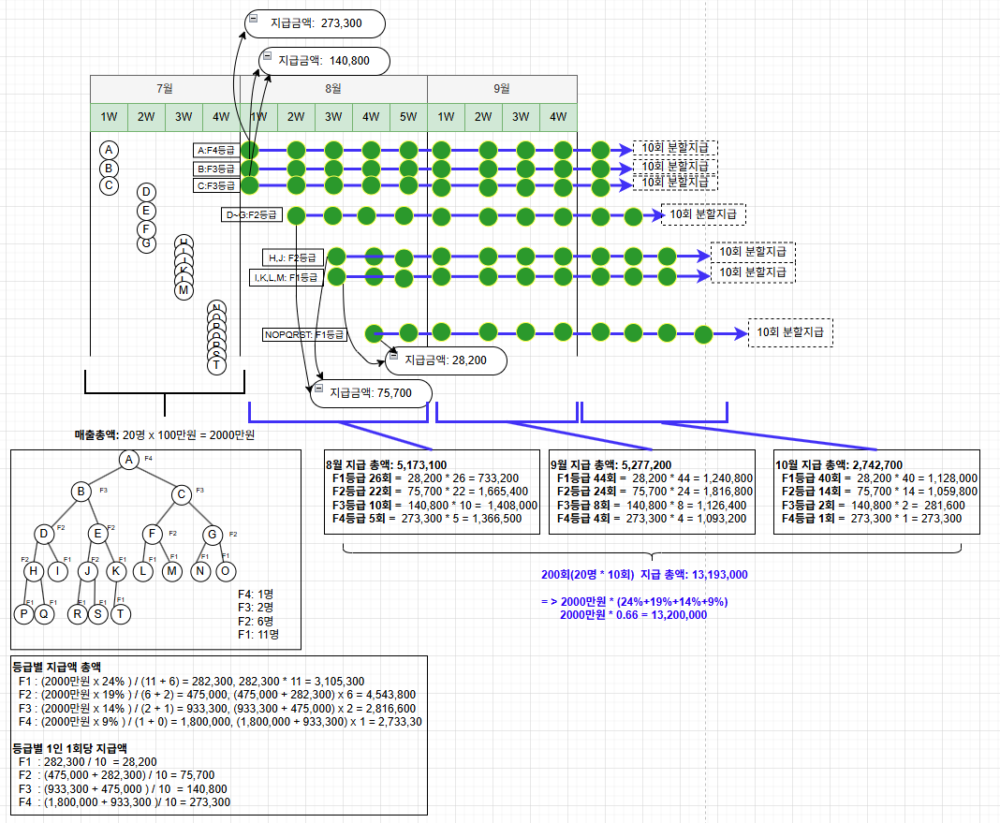
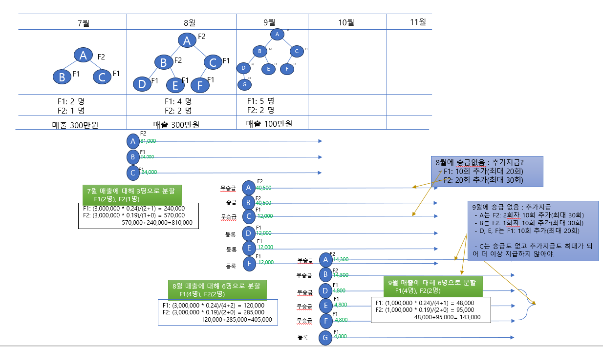

# MLM 시스템 요구사항 검토 문서

**버전**: 5.0 🔥 중요 업데이트
**작성일**: 2025년 10월 12일
**목적**: 지급 대상자 및 추가 지급 방법 재정의

**주요 변경사항 (v5.0):**

- **지급 대상자 재정의**: 등록자 + 승급자 + **추가지급 대상자**
- **추가 지급 시점 변경**: 10회 완료 시 (v3) → **다음 달 승급 없을 때** (v5)
- **매출 분배 기준**: **지급 대상자의 등급 분포**로 계산
- 이미지 다이어그램 추가 ([매출분할지급\_대상자.png](./image/매출분할지급_대상자.png))

---

## 📋 목차

1. [시스템 개요](#1-시스템-개요)
2. [조직 구조 및 등급 시스템](#2-조직-구조-및-등급-시스템)
3. [등록 프로세스](#3-등록-프로세스)
4. [매출 및 수익 배분](#4-매출-및-수익-배분)
5. [지급 제한 규칙](#5-지급-제한-규칙)
6. [운영 프로세스](#6-운영-프로세스)
7. [검토 필요 사항](#7-검토-필요-사항)

---

## 1. 시스템 개요

### 1.1 시스템 목적

MLM(Multi-Level Marketing) 구조 기반 용역자 관리 및 수익 자동 배분 시스템

### 1.2 핵심 기능

- ✅ 이진트리(Binary Tree) 구조로 조직 관리
- ✅ 조직 규모에 따른 8단계 자동 등급 산정 (F1~F8)
- ✅ 매월 신규 가입 인원 기반 매출 계산
- ✅ 등급별 차등 수익 배분 (누적 방식)
- ✅ 10회 분할 지급 (주 단위)

### 1.3 사용자 유형

- **관리자**: 시스템 전체 관리, 용역자 등록/조회, 매출 계산
- **용역자**: 개인 정보 조회, 수익 내역 확인

---

## 2. 조직 구조 및 등급 시스템

### 2.1 이진트리 구조

**기본 원칙:**

- 각 용역자는 최대 2명의 직속 하위자(좌/우)를 보유
- 신규 등록 시 좌측 우선 배치 (L → R)
- 트리 구조 예시:

```
           A (F3)
         /      \
      B (F2)    C (F2)
     /    \    /    \
   D(F1) E(F1) F(F1) G(F1)
```

### 2.2 등급 산정 규칙

| 등급   | 조건                                                                     | 설명                       |
| ------ | ------------------------------------------------------------------------ | -------------------------- |
| **F1** | 하위자 0~1명                                                             | 초기 등급 또는 불완전 노드 |
| **F2** | 좌우 하위자 각 1명씩 보유                                                | 완전 이진 노드             |
| **F3** | 좌우 각각 F2 등급 1명 이상 보유                                          | F2 균형 조직               |
| **F4** | 좌우 각각 F3 등급 1명 이상 보유                                          | F3 균형 조직               |
| **F5** | 전체 조직에 F4 등급 총 3명 이상 보유 `<br>`(좌우 최소 1:2 또는 2:1 이상) | F4 비대칭 조직             |
| **F6** | 전체 조직에 F5 등급 총 3명 이상 보유 `<br>`(좌우 최소 1:2 또는 2:1 이상) | F5 비대칭 조직             |
| **F7** | 전체 조직에 F6 등급 총 3명 이상 보유 `<br>`(좌우 최소 1:2 또는 2:1 이상) | F6 비대칭 조직             |
| **F8** | 전체 조직에 F7 등급 총 3명 이상 보유 `<br>`(좌우 최소 1:2 또는 2:1 이상) | 최고 등급                  |

**등급 계산 방식:**

- 시스템이 자동으로 계산 (실시간)
- 하위 조직 변화 시 상위 조직 등급도 자동 재계산
- 등급 변동에 따른 지급은 익월 지급 부터 적용

### 2.3 실제 조직 예시

#### 예시 1: 8명 조직 (F3까지)

```
                    A (F3)
                  /        \
              B (F2)        C (F2)
             /      \      /      \
          D(F1)  E(F1) F(F1)  G(F1)
```

**등급 산정 과정:**

- D, E, F, G: 하위자 없음 → F1
- B: 좌우 각 F1 보유 → F2
- C: 좌우 각 F1 보유 → F2
- A: 좌우 각 F2 보유 → F3

**등급 분포:**

- F1: 4명 (리프 노드)
- F2: 2명
- F3: 1명 (최상위)

#### 예시 2: 21명 조직 (F4까지)

```
                    1번(F4)
                  /          \
              2번(F3)          3번(F3)
             /      \          /      \
          4번(F2)  5번(F2)  6번(F2)  7번(F2)
         /  \      /  \      /  \      /  \
      8~21번 (모두 F1 등급, 리프 노드)
```

**등급 분포:**

- F1: 14명 (리프 노드)
- F2: 4명
- F3: 2명
- F4: 1명 (최상위)

---

## 3. 등록 프로세스

### 3.1 용역자 등록 방식

용역자는 **2가지 방식**으로 등록 가능합니다:

1. **엑셀 일괄 등록**: 여러 명을 한 번에 등록
2. **개별 등록**: 1명씩 직접 입력

**공통 필수 항목:**

- 성명
- 연락처
- 은행
- 계좌번호
- 판매인(추천인)
- 가입일자
- 설계사 정보

**자동 처리 항목:**

- 로그인 ID: 성명을 소문자로 변환 (중복 시 A, B, C 추가)
- 비밀번호: 전화번호 뒷 4자리 (기본값: 1234)
- 배치 위치: 판매인의 좌측 우선 → 좌측 차있으면 우측

### 3.2 엑셀 일괄 등록

**엑셀 업로드 시 처리:**

1. **1단계**: 모든 용역자를 먼저 시스템에 등록
2. **2단계**: 판매인(추천인) 관계를 바탕으로 트리 구조 연결

### 3.3 개별 등록

**입력 화면:**

- 관리자 페이지에서 "용역자 추가" 기능
- 엑셀과 동일한 항목을 폼으로 입력

**처리 과정:**

1. 필수 항목 입력 (성명, 연락처, 은행, 계좌번호, 판매인, 가입일자, 설계사 정보)
2. 로그인 ID/비밀번호 자동 생성
3. 판매인 검색 및 트리 배치
4. 등급 자동 계산
5. 즉시 시스템에 반영

### 3.4 판매인(추천인) 검색 우선순위

1. **우선순위 1**: 기존에 등록된 용역자 중 이름 검색
2. **우선순위 2**: 같은 엑셀 파일에서 방금 등록된 용역자 중 검색 (일괄 등록 시)

### 3.5 검증 규칙

- ❌ 루트 노드(최상위 용역자)는 1명만 허용
- ❌ 자기 자신을 판매인으로 등록 불가
- ⚠️ 판매인의 좌우 자리가 모두 찬 경우 → 수동 배치 필요 (관리자 알림)

---

## 4. 매출 및 수익 배분

### 4.1 매출 및 지급 기준 (핵심 규칙)

#### 4.1.1 월별 매출 계산

**매출 집계 기간:**

```
매월 1일 00:00:00 ~ 말일 23:59:59
```

**매출 계산 공식:**

```
월 총매출 = 해당 월 신규 가입 인원 × 100만원
```

**예시:**

```
9월 1일~30일 신규 가입: 10명
→ 9월 총매출: 1,000만원
```

**매출 귀속 기준:**

- 엑셀 "날짜" 컬럼의 년/월 기준
- 하나의 엑셀에 여러 달 데이터 포함 가능 → 각 월별로 별도 매출 계산

#### 4.1.2 지급 기본 원칙 ⚠️ 변경됨

| 항목       | 내용                                                         |
| ---------- | ------------------------------------------------------------ |
| **지급일** | 매주 금요일                                                  |
| **등급**   | 매월 말일 기준으로 산출                                      |
| **10분할** | 등록일+1개월 후 첫 금요일부터 10회                           |
| **승급**   | **기존 지급 유지**, 승급월 다음달 첫 금요일부터 새 지급 추가 |

**지급 시작일 예시:**

- 7월 2일 등록 → 8월 2일 이후 첫 금요일부터 시작
- 7월 15일 등록 → 8월 15일 이후 첫 금요일부터 시작
- 8월 중 승급 → **기존 지급 계속** + 9월 첫 금요일부터 새 등급 지급 시작


### 4.2 등급별 수익 배분 비율

| 등급 | 배분 비율 | 배분 방식                                       |
| ---- | --------- | ----------------------------------------------- |
| F1   | 24%       | (총매출 × 24%) ÷ (F1 + F2 인원)                 |
| F2   | 19%       | **F1 지급액** + (총매출 × 19%) ÷ (F2 + F3 인원) |
| F3   | 14%       | **F2 지급액** + (총매출 × 14%) ÷ (F3 + F4 인원) |
| F4   | 9%        | **F3 지급액** + (총매출 × 9%) ÷ (F4 + F5 인원)  |
| F5   | 5%        | **F4 지급액** + (총매출 × 5%) ÷ (F5 + F6 인원)  |
| F6   | 3%        | **F5 지급액** + (총매출 × 3%) ÷ (F6 + F7 인원)  |
| F7   | 2%        | **F6 지급액** + (총매출 × 2%) ÷ (F7 + F8 인원)  |
| F8   | 1%        | **F7 지급액** + (총매출 × 1%) ÷ F8 인원         |

**누적 방식 예시:**

```
총매출: 1,000만원
F1 인원: 50명, F2 인원: 10명, F3 인원: 4명, F4 인원: 2명

F1 개인 지급액 = (1,000만원 × 24%) ÷ (50+10) = 40,000원
F2 개인 지급액 = 40,000원 + (1,000만원 × 19%) ÷ (10+4) = 175,714원
F3 개인 지급액 = 175,714원 + (1,000만원 × 14%) ÷ (4+2) = 409,047원
F4 개인 지급액 = 409,047원 + (1,000만원 × 9%) ÷ (2+0) = 859,047원
```

**100원 단위 절삭:** ⚠️ 변경됨

- **도출 과정**: 등급별 지급액 계산 시 절삭하지 않음 (정확한 금액 유지)
- **최종 10분할**: 10으로 나눈 회차당 금액만 100원 단위 절삭
- 예:
  ```
  등급별 지급액: 409,047원 (절삭 안함)
  회차당 금액: 409,047 ÷ 10 = 40,904.7원 → 40,900원 (절삭)
  ```

### 4.3 10회 분할 지급 및 추가 지급 ⚠️ 중요 변경



#### 4.3.1 기본 10회 분할 지급 및 지급 대상자

**🔥 v5.0 중요 변경: 지급 대상자 재정의**



**지급 대상자 정의:**

매월 용역비 지급 대상자는 다음 **세 가지 유형**으로 구성됩니다:

1. **등록자 (신규 용역자)**
   - 해당 월에 **신규 등록**한 용역자
   - 등록월 다음달 첫 금요일부터 10회 지급 시작
   - **매출 기여**: 등록자 수 × 1,000,000원

2. **승급자 (등급 승급 용역자)**
   - 해당 월에 **등급이 상승**한 용역자
   - 기존 지급 유지 + 승급월 다음달 첫 금요일부터 새 등급 10회 추가 지급
   - **매출 기여**: 없음 (등록 시에만 매출 계산)

3. **추가지급 대상자**
   - 이전 월에 등록 또는 승급했으나, **해당 월에 승급하지 않은** 용역자
   - 기존 지급 계획 계속 진행 (10회 미완료 시)
   - 10회 완료 후 **다음 달 승급이 없으면** 추가 10회 지급 시작
   - **매출 기여**: 없음

**매출 계산:**

```
월별 매출 = 해당 월 등록자 수 × 1,000,000원
```

**지급 금액 계산:**

```
지급 금액 = (월별 매출 × 등급별 배분율) ÷ 해당 등급 지급 대상자 수
```

- ⚠️ **지급 대상자의 등급 분포**를 기준으로 계산 (전체 시스템 등급 분포 아님)
- 지급 대상자 = 등록자 + 승급자 + 추가지급 대상자

**지급 방식:**

- **매주 금요일 지급**
- **등록일+1개월 후 첫 금요일**부터 **연속 10개 금요일** 동안 지급
- 등급 승급 시 **기존 분할 유지**, **승급월 다음달 첫 금요일**부터 새 등급 지급 추가

**예시 1: 등급 유지 시 (기본 10회)**

```
7월 2일: 용역자 등록 (F1)
7월 말일: F1 등급 확정 → 개인 지급액 계산

8월 2일 이후 첫 금요일(8월 4일)부터 지급 시작:
8월 4일(금): 1회차 지급
8월 11일(금): 2회차 지급
8월 18일(금): 3회차 지급
8월 25일(금): 4회차 지급
9월 1일(금): 5회차 지급
9월 8일(금): 6회차 지급
9월 15일(금): 7회차 지급
9월 22일(금): 8회차 지급
9월 29일(금): 9회차 지급
10월 6일(금): 10회차 지급 (기본 10회 완료)

→ 10회 동안 금액은 등록 시 매출 기준으로 계산
→ 다음 달 승급 없으면 추가 지급 대상자로 전환 (4.3.2 참조)
```

**예시 2: 실제 지급 대상자 계산 (7-9월 시나리오)**

```
【7월】
- 등록자: A(F2), B(F1), C(F1) → 3명
- 매출: 3,000,000원
- 지급 대상자: 3명 (F1: 2명, F2: 1명)

【8월】
- 등록자: D(F1), E(F1), F(F1) → 3명
- 승급자: B (F1→F2) → 1명
- 추가지급 대상자: A, C (7월 등록, 8월 승급 없음) → 2명
- 매출: 3,000,000원 (등록자 3명만 계산)
- 지급 대상자: 6명 (F1: 4명[C,D,E,F], F2: 2명[A,B])

【9월】
- 등록자: G(F1) → 1명
- 승급자: 없음
- 추가지급 대상자: A,B,D,E,F (8월 승급 없음, C 제외-최대 횟수 도달) → 5명
- 매출: 1,000,000원 (등록자 1명만 계산)
- 지급 대상자: 6명 (F1: 4명[D,E,F,G], F2: 2명[A,B])
```

#### 4.3.2 추가 지급 시점 (🔥 v5.0 중요 변경)

**🔥 v5.0 변경: 추가 지급 시점 재정의**

**v3.0 (이전):**

- 10회 지급 완료 시 **즉시** 추가 10회 지급 시작

**v5.0 (현재):**

- 10회 지급 완료 후, **다음 달에 승급이 없으면** 추가 10회 지급 시작
- 승급 시에는 새 등급 지급 시작, 추가 지급 안 함

**추가 지급 조건:**

1. **기본 10회 또는 이전 추가 10회 완료**
2. **해당 월에 승급하지 않음**
3. **등급별 최대 수령 횟수 미달**
4. **지급 제한 규칙 충족** (5.3 F3 이상 보험 조건 포함)

**등급별 최대 수령 횟수:**

| 등급   | 최대 수령 횟수 | 추가지급 단계 | 구성 |
| ------ | -------------- | ------------ | ---- |
| **F1** | 20회           | 2단계        | 기본 10회 + 추가 1단계 (10회) |
| **F2** | 30회           | 3단계        | 기본 10회 + 추가 2단계 (20회) |
| **F3** | 40회           | 4단계        | 기본 10회 + 추가 3단계 (30회) |
| **F4** | 40회           | 4단계        | 기본 10회 + 추가 3단계 (30회) |
| **F5** | 50회           | 5단계        | 기본 10회 + 추가 4단계 (40회) |
| **F6** | 50회           | 5단계        | 기본 10회 + 추가 4단계 (40회) |
| **F7** | 60회           | 6단계        | 기본 10회 + 추가 5단계 (50회) |
| **F8** | 60회           | 6단계        | 기본 10회 + 추가 5단계 (50회) |

- **추가지급 단계**: 매월 승급 없이 유지 시 해당 월 매출 기준 10회 추가 (예: 7월분, 8월분, 9월분...)

**🔥 중요: 매출월 기준 지급 방식**

- 등록/승급 시: 해당 월 매출 기준 10회 지급 계획 생성
- 다음 달 승급 없음: 다음 달 매출 기준 추가 10회 지급 계획 생성
- **각 매출월별 10회씩 병행 지급!**

**예시 1: A 용역자 - 추가 지급 발생 (승급 없음)**

```
【7월】
- A: F2 등록 (등록자)
- 매출: 3,000,000원 (A, B, C 3명 등록)
- 생성: 7월 F2 매출분 10회 (기본 10회)

【8월】
- A: F2 유지, 승급 없음 (추가지급 대상자)
- 생성: 8월 F2 매출분 10회 (추가 1차, 누적 20회) ← 승급 없으므로 추가!
- A 지급 시작: 8월 첫 금요일부터
  - 7월F2 1회

【9월】
- A: F2 유지, 승급 없음 (추가지급 대상자)
- 생성: 9월 F2 매출분 10회 (추가 2차, 누적 30회) ← 승급 없으므로 추가! F2 최대 30회 도달!
- A 지급:
  - 7월F2 2~5회
  - 8월F2 1~4회 (병행)
  - 9월F2 1회 (병행)

【10월】
- A: F2 유지, 최대 횟수 도달 (더 이상 추가지급 대상자 아님!)
- 생성: 없음 (F2 최대 30회 이미 9월에 도달! 7월10+8월10+9월10=30회)
- A 지급: 기존 계획 소진 중
  - 7월F2 6~9회
  - 8월F2 5~8회 (병행)
  - 9월F2 2~5회 (병행)

【11월】
- A: F2 유지, 최대 횟수 도달
- 지급: 기존 계획 소진 중
  - 7월F2 10회 (완료) ⭐
  - 8월F2 9~10회 + 2회 (완료) ⭐
  - 9월F2 6~9회

【12월】
- A: F2 유지, 최대 횟수 도달
- 지급: 기존 계획 소진 중
  - 9월F2 10회 (완료) ⭐ → F2 총 30회 완료!

【1월 이후】
- A: F2 유지, 최대 횟수 도달
- 지급: 없음 (F2 최대 30회 모두 지급 완료)

→ F2 최대 30회 = 기본 10회(7월) + 추가 20회(8월+9월)
→ 9월에 이미 30회 계획 생성 완료, 10월부터 생성 안 함!
→ 매월 승급 확인 후 추가 생성, 최대 횟수까지만!
```

**예시 2: B 용역자 - 추가 지급 없음 (승급 발생)**

```
【7월】
- B: F1 등록 (등록자)
- 매출: 3,000,000원 (A, B, C 3명 등록)
- 생성: 7월 F1 매출분 10회 (기본)

【8월】
- B: F1→F2 승급! (승급자) ⭐
- 생성: 8월 F2 매출분 10회 (기본, 승급이므로 F1 추가 없음)
- B 지급 시작: 8월 첫 금요일부터
  - 7월F1 1회

【9월】
- B: F2 유지, 승급 없음 (추가지급 대상자)
- 생성: 9월 F2 매출분 10회 (추가 1차) ← F2 추가!
- B 지급:
  - 7월F1 2~5회
  - 8월F2 1~4회 (병행)
  - 9월F2 1회 (병행)

【10월】
- B: F2 유지, 승급 없음 (추가지급 대상자)
- 생성: 10월 F2 매출분 10회 (추가 2차) ← F2 추가!
- B 지급:
  - 7월F1 6~9회
  - 8월F2 5~8회 (병행)
  - 9월F2 2~5회 (병행)
  - 10월F2 1회 (병행)

【11월】
- B: F2 유지, 최대 횟수 도달 (더 이상 추가지급 대상자 아님!)
- 생성: 없음 (F2 최대 30회 이미 10월에 도달! 8월10+9월10+10월10=30회)
- B 지급: 기존 계획 소진 중
  - 7월F1 10회 (완료) ⭐
  - 8월F2 9~10회 + 2회 (완료) ⭐
  - 9월F2 6~9회
  - 10월F2 2~5회

【12월】
- B: F2 유지, 최대 횟수 도달
- 지급: 기존 계획 소진 중
  - 9월F2 10회 (완료) ⭐
  - 10월F2 6~9회

【1월】
- B: F2 유지, 최대 횟수 도달
- 지급: 기존 계획 소진 중
  - 10월F2 10회 (완료) ⭐ → F2 총 30회 완료!

【2월 이후】
- B: F2 유지, 최대 횟수 도달
- 지급: 없음 (F2 최대 30회 모두 지급 완료)

→ 7월 F1 10회 (8월 승급으로 추가 없음)
→ 8월 F2 10회 + 9월 F2 10회 + 10월 F2 10회 = F2 총 30회
→ 승급 시 기존 등급 추가 생성 안 함!
```

**예시 3: C 용역자 - 최대 횟수 도달**

```
【7월】
- C: F1 등록 (등록자)
- 매출: 3,000,000원 (A, B, C 3명 등록)
- 생성: 7월 매출 기준 F1 10회 지급 계획

【8월】
- C: F1 유지, 승급 없음 (추가지급 대상자)
- 생성: 8월 매출 기준 F1 10회 지급 계획 ← 추가 지급 발생!
- C 지급 시작: 8월 첫 금요일부터
  - 7월 매출분 F1 1회차 지급

【9월】
- C: F1 유지 (추가지급 대상자)
- C 지급:
  - 7월 매출분 F1 2~5회차
  - 8월 매출분 F1 1~4회차 (병행)

【10월】
- C: F1 유지, 승급 없음 (추가지급 대상자)
- C 지급:
  - 7월 매출분 F1 6~9회차
  - 8월 매출분 F1 5~8회차 (병행)

【11월】
- C: F1 유지 (추가지급 대상자)
- C 지급:
  - 7월 매출분 F1 10회차 (완료) ⭐
  - 8월 매출분 F1 9~10회차 + 2회차 (완료) ⭐
  - → F1 최대 20회 도달!

【12월】
- C: F1 유지, 승급 없음, 최대 횟수 도달
- C 지급: 없음 (F1 최대 20회 도달, 추가 지급 계획 생성 안 함)

【1월】
- C: F1 유지 (최대 횟수 도달)
- C 지급: 없음

【2월】
- C: F2로 승급! (승급자) ⭐
- 생성: 2월 매출 기준 F2 10회 지급 계획 ← 승급으로 새 등급 시작!
- C 지급: 없음 (3월부터 시작)

【3월】
- C: F2 유지 (추가지급 대상자)
- C 지급 시작: 3월 첫 금요일부터
  - 2월 매출분 F2 1~4회차

→ F1 최대 20회 (7월 매출 10회 + 8월 매출 10회)
→ F2 승급 시 새로운 매출분 기준으로 시작!
```

**예시 4: 전체 시나리오 (7-11월) - 매출월 기준 병행 지급**

```
【7월】
- 등록자: A(F2), B(F1), C(F1) → 3명
- 매출: 3,000,000원
- 생성: A=7월F2, B=7월F1, C=7월F1

【8월】
- 등록자: D(F1), E(F1), F(F1) → 3명
- 승급자: B(F1→F2) → 1명
- 추가지급 대상자: A(F2), C(F1) → 2명
- 매출: 3,000,000원
- 생성: D=8월F1, E=8월F1, F=8월F1, B=8월F2, A=8월F2, C=8월F1
- 지급 대상자: 6명 (F1: 4명[C,D,E,F], F2: 2명[A,B])
- 지급 시작 (8월 첫 금요일):
  - A: 7월F2 1회 + 8월F2 1회 (병행)
  - B: 7월F1 1회 + 8월F2 1회 (병행, F1 승급으로 추가 없음)
  - C: 7월F1 1회 + 8월F1 1회 (병행)
  - D, E, F: 8월F1 1회

【9월】
- 등록자: G(F1) → 1명
- 승급자: 없음
- 추가지급 대상자: A,B,C,D,E,F → 6명
- 매출: 1,000,000원
- 생성: G=9월F1, A=9월F2, B=9월F2, C=없음, D=9월F1, E=9월F1, F=9월F1
  - A: 9월F2 생성으로 F2 최대 30회 도달! (7월+8월+9월=30회)
  - B: 9월F2 생성으로 F2 누적 20회 (8월+9월=20회, 추가 10회 남음)
  - C: F1 최대 20회 이미 도달 (7월+8월=20회, 생성 안 함)
  - D,E,F: 9월F1 생성으로 F1 최대 20회 도달! (8월+9월=20회)
- 지급 대상자: 6명 (F1: 4명[D,E,F,G], F2: 2명[A,B])
- 지급:
  - A: 7월F2 2~5회 + 8월F2 2~5회 + 9월F2 1회 (3개 병행)
  - B: 7월F1 2~5회 + 8월F2 2~5회 + 9월F2 1회 (3개 병행)
  - C: 7월F1 2~5회 + 8월F1 2~5회 (2개, 최대 20회 소진 중)
  - D, E, F: 8월F1 2~5회 + 9월F1 1회 (2개 병행)
  - G: 9월F1 1회

【10월】
- 등록자: 없음
- 승급자: 없음
- 추가지급 대상자: B,G → 2명만! (나머지 최대 도달)
- 매출: 0원
- 생성: B=10월F2 (B만 F2 추가 3차, 30회 도달!)
- 지급:
  - A: 7월F2 6~9회 + 8월F2 6~9회 + 9월F2 2~5회 (최대 도달, 소진 중)
  - B: 7월F1 6~9회 + 8월F2 6~9회 + 9월F2 2~5회 + 10월F2 1회 (4개 병행)
  - C: 7월F1 6~9회 + 8월F1 6~9회 (최대 도달, 소진 중)
  - D, E, F: 8월F1 6~9회 + 9월F1 2~5회 (최대 도달, 소진 중)
  - G: 9월F1 2~5회 (추가지급 대상자)

【11월】
- 등록자: 없음
- 승급자: 없음
- 추가지급 대상자: G → 1명만!
- 매출: 0원
- 생성: G=10월F1 (G만 F1 추가 1차, 누적 20회 도달!)
- 지급:
  - A: 7월F2 10회(완료) + 8월F2 10회(완료) + 9월F2 6~9회 (소진 중)
  - B: 7월F1 10회(완료) + 8월F2 10회(완료) + 9월F2 6~9회 + 10월F2 2~5회 (소진 중)
  - C: 7월F1 10회(완료) + 8월F1 10회(완료) ⭐ → F1 20회 완료!
  - D, E, F: 8월F1 10회(완료) + 9월F1 6~9회 (소진 중)
  - G: 9월F1 6~9회 + 10월F1 1회 (2개 병행)

【12월】
- 추가지급 대상자: 없음 (모두 최대 도달)
- A: 9월F2 10회(완료) ⭐ → F2 30회 완료!
- B: 9월F2 10회(완료) + 10월F2 6~9회 (소진 중)
- C: 지급 없음
- D, E, F: 9월F1 10회(완료) ⭐ → F1 20회 완료!
- G: 9월F1 10회(완료) + 10월F1 2~5회 (소진 중)

【1월】
- B: 10월F2 10회(완료) ⭐ → F2 30회 완료!
- G: 10월F1 6~9회 (소진 중)

【2월】
- G: 10월F1 10회(완료) ⭐ → F1 20회 완료!

→ 매월 승급 확인 후 최대 횟수까지만 추가 생성!
→ A: F2 30회(7+8+9), B: F2 30회(8+9+10), C: F1 20회(7+8)
→ D,E,F: F1 20회(8+9), G: F1 20회(9+10)
```

#### 4.3.3 승급 시 지급 처리 요약

**승급 시 기본 원칙:**

1. **기존 기본 지급 유지**: 승급 전 등급의 기본 매출분 지급은 끝까지 계속
2. **새 등급 추가**: 승급월 매출 기준 새 등급 지급 시작
3. **병행 지급**: 같은 금요일에 두 등급 지급 동시 수령 가능
4. **추가 지급 중단**: 승급 시 기존 등급의 추가 매출분 지급은 즉시 중단

**핵심 정리:**

| 상황 | 기존 등급 기본 지급 | 기존 등급 추가 지급 | 새 등급 지급 |
|------|------------------|------------------|-------------|
| **기본 지급 중 승급** | 계속 진행 (병행) | 생성 안 함 | 새 등급 시작 (병행) |
| **추가 지급 중 승급** | 계속 진행 (병행) | 즉시 중단 | 새 등급 시작 (병행) |
| **최대 횟수 후 승급** | 지급 종료 | - | 새 등급 시작 |

**참고**: 자세한 예시는 4.3.2의 예시 2 (B 용역자) 참조

### 4.4 원천징수

- 지급액의 **3.3% 원천징수**
- 실지급액 = 지급액 × 96.7%

---

### 4.5 총매출 수동 조정 (관리자 기능) ⚠️ 변경됨

**기능:**

- 관리자가 특정 월의 **총매출 금액을 수동으로 조정** 가능
- 조정된 총매출로 등급별 지급액이 자동 재계산됨

**조정 방법:**

```

예시: 2024년 9월 매출 조정

자동 계산된 총매출: 10,000,000원 (10명 × 100만원)

관리자가 총매출을 15,000,000원으로 조정
→ 모든 등급별 지급액이 자동으로 재계산됨

F1: 24% 비율 유지, 금액 증가
F2: 19% 추가 비율 유지, 금액 증가
...

```

**적용 효과:**

- ✅ 총매출만 조정하면 등급별 비율에 따라 **자동 재계산**
- ✅ 등급별 배분 비율(24%, 19%, 14% 등)은 **유지**
- ✅ 특정 월만 선택적으로 조정 가능
- ✅ 조정 이력 기록 및 관리

**예시:**

```

9월 자동 총매출: 1,000만원

- F1 개인 지급액: 40,000원
- F2 개인 지급액: 81,000원

관리자가 총매출을 1,500만원으로 조정:

- F1 개인 지급액: 60,000원 (1.5배)
- F2 개인 지급액: 121,500원 (1.5배)

```

---

## 5. 지급 제한 규칙

### 5.1 등급별 최대 수령 횟수 ⚠️ 변경됨

**목적**: 같은 등급이 계속 유지되면 최대 수령 횟수 제한

**등급별 최대 수령기간:**

| 등급   | 최대 수령 횟수 | 대응 매출 기간  | 구성                            |
| ------ | -------------- | --------------- | ------------------------------- |
| **F1** | 20회           | 최대 2개월 매출 | 등록/승급 10회 + 추가 지급 10회 |
| **F2** | 30회           | 최대 3개월 매출 | 등록/승급 10회 + 추가 지급 20회 |
| **F3** | 40회           | 최대 4개월 매출 | 등록/승급 10회 + 추가 지급 30회 |
| **F4** | 40회           | 최대 4개월 매출 | 등록/승급 10회 + 추가 지급 30회 |
| **F5** | 50회           | 최대 5개월 매출 | 등록/승급 10회 + 추가 지급 40회 |
| **F6** | 50회           | 최대 5개월 매출 | 등록/승급 10회 + 추가 지급 40회 |
| **F7** | 60회           | 최대 6개월 매출 | 등록/승급 10회 + 추가 지급 50회 |
| **F8** | 60회           | 최대 6개월 매출 | 등록/승급 10회 + 추가 지급 50회 |

**예시 1: F2 등급 유지 시**

```

7월: F2 등록
8월~9월: 기본 10회 지급 (1~10회)
10월~11월: 추가 지급 (11~20회)
12월~1월: 추가 지급 (21~30회) ← F2 최대치 도달
2월: 여전히 F2 → 지급 대상 제외

```

**예시 2: 추가 지급기간 중 승급**

```

7월: F2 등록 → 10회 지급 시작
8월~9월: 추가 지급 (11~22회)
10월: F4 승급! → F2 추가 지급 초기화 (22회에서 중단)
11월: F4 새로운 10회 시작 (F4 기준 1~10회)

```

### 5.2 승급 시 처리 방식 ⚠️ 변경됨

**원칙:**

- **등록/승급에 의한 10회 지급: 중단하지 않고 완료까지 계속**
- **추가 지급기간: 승급 시 초기화되고 중단**
- **새 등급: 승급월 다음달 첫 금요일부터 10회 시작**

**예시 1: 등록/승급 10회 중 승급**

```

7월: F1 등록 → 10회 지급 시작 (1~3회)
8월: F3 승급!
→ F1 10회 계속 진행 (4~10회까지 완료)
→ 9월부터 F3 10회 시작 (F3 기준 1~10회)
→ F1과 F3 병행 지급

```

**예시 2: 추가 지급기간 중 승급**

```

7월: F2 등록 → 10회 지급 (1~10회)
8월~9월: F2 추가 지급 (11~22회)
10월: F4 승급!
→ F2 추가 지급 중단 (22회에서 종료)
→ 11월부터 F4 10회 시작 (F4 기준 1~10회)

```

### 5.3 F3 이상 보험 유지 조건

**필수 보험 최소 금액:**

| 등급   | 최소 보험금액 |
| ------ | ------------- |
| F3, F4 | 월 50,000원   |
| F5, F6 | 월 70,000원   |
| F7, F8 | 월 100,000원  |

**조건 미달 시:**

- 해당 월 매출의 **지급 대상에서 제외**
- 등급은 유지되지만 수익 지급만 중단

**보험 재가입 시:**

```

예시:
1월: F3, 보험 50,000원 유지 → 1월 매출 10회 지급 (누적 10회)
2월: F3, 보험 해지 → 2월 매출 지급 제외 (누적 10회 유지)
3월: F3, 보험 50,000원 재가입 → 3월 매출 10회 지급 (누적 20회로 계속)

```

**핵심:** 보험 해지 후 재가입해도 **기존 회수 유지** (리셋 안 됨)

---

## 6. 운영 프로세스

### 6.1 월간 운영 흐름

```

[매월 말일]

1. 신규 가입 마감
2. 월 총매출 집계 (신규 인원 × 100만원)
3. 등급별 인원 분포 확인
4. 등급별 개인 지급액 계산
5. 10주 분할 지급 스케줄 생성

[익월부터 10주간] 6. 매주 자동 지급 실행 7. 원천징수 3.3% 공제 8. 용역자별 입금 처리

```

### 6.2 자동 처리 항목

- ✅ 신규 등록 시 트리 구조 자동 배치
- ✅ 등급 자동 계산 및 갱신
- ✅ 월별 매출 자동 집계
- ✅ 지급액 자동 계산
- ✅ 주별 지급 스케줄 자동 생성
- ✅ 지급 회수 카운터 자동 증가
- ✅ 등급 변경 시 카운터 자동 리셋

### 6.3 관리자 수동 작업

#### 6.3.1 F3 이상 보험 유지 조건 설정

**기능:**

- 용역자 편집 화면에서 보험 유지 조건 설정
- F3 이상 등급 용역자에 대해 적용

**설정 항목:**

- 보험 유지 여부: 활성/비활성
- 보험 유지 금액: 금액 입력 (원 단위)

**관리 방법:**

```

용역자 편집 화면:

- 이름: 홍길동
- 등급: F3
- 보험 유지 여부: ☑ 활성
- 보험 금액: 50,000원

```

#### 6.3.2 총매출 수동 조정

**기능:**

- 특정 월의 **총매출 금액을 수동으로 조정**
- 등급별 배분 비율은 유지하면서 금액만 조정

**설정 방법:**

```

예시: 2024년 9월 매출 조정

자동 계산: 10명 등록 → 10,000,000원
관리자 조정: 15,000,000원으로 변경

```

**적용 효과:**

```

9월 매출 자동 계산 결과:

- 총매출: 10,000,000원
- F1 인원: 50명, F2 인원: 10명
- F1 개인: 40,000원
- F2 개인: 81,000원

관리자가 총매출을 15,000,000원으로 조정:

- F1 개인: 60,000원 (비율 유지, 1.5배 증가)
- F2 개인: 121,500원 (비율 유지, 1.5배 증가)

```

**주요 특징:**

- ✅ **총매출만 조정**, 등급별 비율은 자동 유지
- ✅ **월별로 설정 가능** (9월분, 10월분 등)
- ✅ 조정하지 않은 월은 자동 계산 금액 사용
- ✅ 10회 분할 방식은 동일하게 적용
- ✅ 조정 이력 기록 및 관리

---

## 7. 시스템 규칙 종합 정리

### 7.1 매출 및 지급 프로세스 전체 흐름 ⚠️ 중요 변경

```

[Step 1] 매월 말일
├─ 1일~말일 신규 가입자 집계
├─ 월 총매출 = 가입자 수 × 100만원
├─ 말일 기준 등급별 인원 분포 확인
└─ 등급별 개인 지급액 계산

[Step 2] 등록/승급 10회 지급 (등록일+1개월 후 첫 금요일부터)
├─ 각 금요일마다:
│ ├─ 등급 확정 (등록/승급월 말일 기준, 10회 동안 고정)
│ ├─ 지급액 ÷ 10 = 회차 지급액
│ ├─ 원천징수 3.3% 공제
│ └─ 실지급
│
└─ 10회 완료 (승급해도 중단하지 않음)

[Step 3] 추가 지급기간 (같은 등급 유지 시)
├─ 등록/승급 10회 완료 후 계속 지급
├─ 등급별 최대 수령 횟수까지 지급
│ ├─ F1: 최대 20회 (기본 10회 + 추가 10회)
│ ├─ F2: 최대 30회 (기본 10회 + 추가 20회)
│ ├─ F3~F8: 40~60회 (등급별 상이)
└─ 최대 횟수 도달 시 지급 종료

[Step 4] 승급 시 처리
├─ 등록/승급 10회: 중단하지 않고 완료까지 계속
├─ 추가 지급기간: 초기화되고 중단
├─ 승급월 말일 기준 새 등급 확정
└─ 승급월 다음달 첫 금요일부터 새 등급 10회 시작
→ 기존 지급과 병행 가능

```

**종합 예시: 승급 시 병행 지급**

```

[7월]

- 7/2: 홍길동 등록 (F1)
- 7/말일: F1 등급 확정
- 총매출: 1,000만원
- F1 지급액: 40,000원

[8월 4일부터 F1 지급 시작]

- 8/4(금): F1 1회차 4,000원
- 8/11(금): F1 2회차 4,000원
- 8/18(금): F1 3회차 4,000원

[8월 20일]

- F3로 승급! ⭐
- 8/말일: F3 등급 확정
- F3 지급액: 200,000원

[9월 1일(금)부터 병행 지급]

- 9/1(금): F1 4회 4,000원 + F3 1회 20,000원 = 24,000원
- 9/8(금): F1 5회 4,000원 + F3 2회 20,000원 = 24,000원
- 9/15(금): F1 6회 4,000원 + F3 3회 20,000원 = 24,000원
- ...
- 10/13(금): F1 10회 4,000원 (F1 완료) + F3 7회 20,000원 = 24,000원
- 10/20(금): F3 8회 20,000원 (F3만 지급)
- ...
- 11/3(금): F3 10회 20,000원 (F3 완료)

→ 승급 후 F1 10회 + F3 10회 병행 지급
→ F3 유지 시 11/10(금)부터 F3 추가 지급 시작 (11~40회)

```

### 7.2 주요 변경사항 요약 ⚠️ 중요 업데이트

| 항목              | 기존 방식 (v1)             | 신규 방식 (v2)                                 | 최종 방식 (v3) ⚠️                                    |
| ----------------- | -------------------------- | ---------------------------------------------- | ---------------------------------------------------- |
| **지급일**        | 주차별 (요일 불명)         | **매주 금요일**                                | **매주 금요일** (유지)                               |
| **매출 집계**     | createdAt 기준             | **매월 1일~말일**                              | **매월 1일~말일** (유지)                             |
| **등급 기준**     | 매출 발생 월 등급 고정     | **매출월 말일 등급으로 확정**                  | **매출월 말일 등급으로 확정** (유지)                 |
| **지급 시작**     | 익월 첫 금요일             | **등록일+1개월 후 첫 금요일**                  | **등록일+1개월 후 첫 금요일** (유지)                 |
| **기본 지급**     | 10회 동일 금액             | **10회 동일 금액**                             | **10회 동일 금액** (유지)                            |
| **추가 지급**     | 없음                       | 없음                                           | **등급별 최대 횟수까지 추가 지급** ✅ 신규           |
| **승급 시 처리**  | 미정의                     | 기존 분할 종료, 승급월 다음달 첫 금요일 재시작 | **기존 지급 유지, 새 지급 추가 (병행)** ✅ 중요 변경 |
| **중첩 지급**     | 여러 매출 동시 지급 (복잡) | 한 시점에 하나만 지급                          | **승급 시 두 등급 병행 지급 가능** ✅ 변경           |
| **수동 설정**     | 없음                       | **관리자 총매출 조정 가능**                    | **관리자 총매출 조정 가능** (유지)                   |
| **최대 수령횟수** | 등급별 최대 회수 (불명확)  | 등급별 최대 회수 제한                          | **기본 10회 + 추가 지급 (등급별 상이)** ✅ 명확화    |

### 7.3 최종 규칙 요약

**✅ 등록/승급 10회 지급**

- 등록일+1개월 후 첫 금요일부터 10회
- 승급 시에도 중단하지 않고 10회 완료까지 계속
- 승급월 다음달 첫 금요일부터 새 등급 10회 추가

**✅ 추가 지급기간** (신규)

- 등록/승급 10회 완료 후, 같은 등급 유지 시 계속 지급
- 등급별 최대 수령 횟수: F1(20회), F2(30회), F3~F8(40~60회)
- 추가 지급 중 승급 시 초기화

**✅ 승급 시 병행 지급** (중요)

- 기존 등급 지급: 중단 없이 완료까지
- 새 등급 지급: 승급월 다음달부터 시작
- 같은 금요일에 두 등급 동시 지급 가능

**✅ 유지되는 기본 규칙**

- 이진트리 구조 및 L→R 배치
- F1~F8 등급 자동 계산
- 누적식 지급액 계산 (F1 24% 기준)
- 100원 단위 절삭 (10분할 시에만)
- 원천징수 3.3%
- F3 이상 보험 조건
- 관리자 총매출 조정 기능

### 7.4 ✅ 확인 필요 항목 체크리스트

- [ ] 수동 금액 입력 시 10회 동안 고정 유지 확인
- [ ] 같은 금요일에 중첩 지급 시 모두 동일 등급 기준일 사용 확인
- [ ] 전월에 해당 일자 없을 때 전월 말일 사용 확인
- [ ] 보험 금액 입력 방법: 관리자 입력? 연동?
- [ ] F1~F2 용역자는 보험 조건 없음 확인
- [ ] 등급별 최대 회수 도달 시 용역자 알림 필요 여부
- [ ] 보험 해지 시 용역자 알림 필요 여부

---

## 8. 주요 용어 정리

| 용어            | 설명                                         |
| --------------- | -------------------------------------------- |
| **용역자**      | MLM 조직 참여자                              |
| **판매인**      | 신규 용역자를 추천한 상위 용역자             |
| **이진트리**    | 각 노드가 최대 2개 자식을 갖는 트리 구조     |
| **등급**        | F1~F8, 조직 규모에 따라 자동 산정            |
| **누적식 배분** | 하위 등급 지급액을 상위 등급이 포함하여 수령 |
| **회차**        | 10회 분할 지급의 각 단위 (1회차~10회차)      |
| **지급 총회수** | 같은 등급 유지 중 받은 총 지급 횟수          |
| **카운터 리셋** | 등급 상승 시 지급 총회수를 0으로 초기화      |

---

## 9. 수정 및 추가 요구사항

### 9.1 수정 요구사항

```

(기존 내용 중 수정이 필요한 부분을 기재해 주세요)

```

### 9.2 추가 요구사항

```

(새로운 기능이나 규칙이 필요한 경우 기재해 주세요)

```

---

**문서 끝**

_본 문서는 개발 요구사항 확인을 위한 검토 문서입니다._

```

```
